<!-- 実装から生成。直接編集しない。入力SHA256: 7ce322b2bb5c68dab4c51499ae55d5e49bae34d22b47e21dd6264975362b5d49 -->

# 反映ジョブを再処理 — シーケンス

章構成: [lazunex API帳票](https://github.com/tsuji-tomonori/lazunex/tree/096e1e580ab1c0670c57e4febad2bd9fdd4698ee/docs/spec/40.apis)。

```mermaid
sequenceDiagram
    participant U as 利用者
    participant A as API router
    participant F as 個別処理 functions
    participant E as HTTP例外ハンドラ
    participant L as 型付き運用ログ
    participant D as PostgreSQLまたはDSQL
    participant S as 内容ハッシュ実体
    participant M as モデル・検索エンジン
    U->>A: POST /api/operations/jobs/{job_id}
    Note over A,D: 依存注入でtransaction開始・組織と所属を確認
    A->>D: 現在の組織の組織名・改訂番号・利用停止状態を取得する。
    opt 検証不成立：bool(organizations) and (not organizations[0].suspended)
    break エラー応答を返して終了（後続の正常処理は実行しない）
    A->>E: Problemまたは依存先例外をHTTP応答へ変換・transactionはrollback
    E->>L: KR_HTTP_REJECTED / 業務条件または入力検証によりリクエストを拒否しました。
    E-->>U: HTTP 401 / {code： "unauthenticated", message： "ログインが必要です。", request_id： 相関ID}
    end
    end
    A->>D: 現在の組織に属する利用者を識別子順に一覧取得する。
    opt 検証不成立：len(users) == 1
    break エラー応答を返して終了（後続の正常処理は実行しない）
    A->>E: Problemまたは依存先例外をHTTP応答へ変換・transactionはrollback
    E->>L: KR_HTTP_REJECTED / 業務条件または入力検証によりリクエストを拒否しました。
    E-->>U: HTTP 401 / {code： "unauthenticated", message： "ログインが必要です。", request_id： 相関ID}
    end
    end
    A->>D: 現在の組織に属する部署を識別子順に一覧取得する。
    A->>D: 現在の組織に属する部署所属を識別子順に一覧取得する。
    A->>F: ジョブを実行できる運用権限を確認する。
    opt 検証不成立：ctx.user.operator
    break エラー応答を返して終了（後続の正常処理は実行しない）
    A->>E: Problemまたは依存先例外をHTTP応答へ変換・transactionはrollback
    E->>L: KR_HTTP_REJECTED / 業務条件または入力検証によりリクエストを拒否しました。
    E-->>U: HTTP 403 / {code： "forbidden", message： "この操作は許可されていません。", request_id： 相関ID}
    end
    end
    A->>F: 現在の組織に属する指定の反映・削除ジョブについて、対象文書と版・処理種別・進行状態・試行回数を取得する。
    A->>D: 現在の組織に属する指定の反映・削除ジョブについて、対象文書と版・処理種別・進行状態・試行回数を取得する。
    A->>F: 実行対象のジョブが存在することを確認する。
    opt 検証不成立：bool(rows)
    break エラー応答を返して終了（後続の正常処理は実行しない）
    A->>E: Problemまたは依存先例外をHTTP応答へ変換・transactionはrollback
    E->>L: KR_HTTP_REJECTED / 業務条件または入力検証によりリクエストを拒否しました。
    E-->>U: HTTP 404 / {code： "not_found", message： "対象を利用できません。", request_id： 相関ID}
    end
    end
    A->>F: ジョブの再試行回数の上限を確認する。
    opt 検証不成立：job.attempts < 5
    break エラー応答を返して終了（後続の正常処理は実行しない）
    A->>E: Problemまたは依存先例外をHTTP応答へ変換・transactionはrollback
    E->>L: KR_HTTP_REJECTED / 業務条件または入力検証によりリクエストを拒否しました。
    E-->>U: HTTP 429 / {code： "limit", message： "利用上限に達しました。", request_id： 相関ID}
    end
    end
    A->>F: ジョブが完了または旧版として終了しているかを判定する。
    alt f.is_finished_job(job)
    Note over A: この処理からreturn
    end
    rect rgb(245, 247, 250)
    Note over A: 例外を捕捉する処理範囲
    A->>F: ジョブが保存期間後の実体削除を要求しているかを判定する。
    alt f.is_purge_job(job)
    A->>F: 現在の組織に属する指定の文書について、文書の所有部署・公開範囲・状態・公開版の参照を取得する。
    A->>D: 現在の組織に属する指定の文書について、文書の所有部署・公開範囲・状態・公開版の参照を取得する。
    A->>F: 削除ジョブの対象文書が削除状態ではないかを判定する。
    alt f.is_restored_document(doc)
    Note over A: この処理からreturn
    end
    A->>F: 削除までの保存期間が経過していないかを判定する。
    A->>F: now
    alt f.is_within_retention(ctx, job)
    Note over A: この処理からreturn
    end
    A->>F: 現在の組織に属する検索用の文書断片を識別子順に一覧取得する。
    A->>D: 現在の組織に属する検索用の文書断片を識別子順に一覧取得する。
    A->>F: 現在の組織に属する添付画像を識別子順に一覧取得する。
    A->>D: 現在の組織に属する添付画像を識別子順に一覧取得する。
    A->>F: 現在の組織に属する文字認識の実行記録を識別子順に一覧取得する。
    A->>D: 現在の組織に属する文字認識の実行記録を識別子順に一覧取得する。
    A->>F: 現在の組織に属する下書きを識別子順に一覧取得する。
    A->>D: 現在の組織に属する下書きを識別子順に一覧取得する。
    A->>F: 現在の組織に属する文書版を識別子順に一覧取得する。
    A->>D: 現在の組織に属する文書版を識別子順に一覧取得する。
    A->>F: 現在の組織に属する回答履歴を識別子順に一覧取得する。
    A->>D: 現在の組織に属する回答履歴を識別子順に一覧取得する。
    A->>F: 処理対象の識別子を重複なく取り出す。
    A->>D: 現在の組織に属する文書を識別子順に一覧取得する。
    A->>F: 削除文書の実体参照と、他文書・質問が引き続き使う保護対象を分類する。
    loop sorted(keys - protected)
    A->>F: 不要になった実体または検索索引を削除する。
    A->>S: 実体を削除
    end
    A->>F: 用途と対象に一致するデータだけを取り出す。
    A->>F: 不要になった実体または検索索引を削除する。
    A->>M: delete
    loop target_chunks[：100]
    A->>F: 現在の組織に属する指定の検索用の文書断片の記録を削除する。
    A->>D: 現在の組織に属する指定の検索用の文書断片の記録を削除する。
    end
    A->>F: 一回の上限を超える削除対象の断片が残っているかを判定する。
    alt f.has_more_target_chunks(target_chunks)
    Note over A: この処理からreturn
    end
    A->>F: 用途と対象に一致するデータだけを取り出す。
    loop target_runs[：100]
    A->>F: 現在の組織に属する指定の文字認識の実行記録の記録を削除する。
    A->>D: 現在の組織に属する指定の文字認識の実行記録の記録を削除する。
    end
    A->>F: 一回の上限を超える削除対象のOCR記録が残っているかを判定する。
    alt f.has_more_target_ocr(target_runs)
    Note over A: この処理からreturn
    end
    loop assets
    A->>F: 添付画像が削除対象の文書に属するかを判定する。
    alt f.is_target_asset(asset, doc)
    A->>F: 現在の組織に属する指定の添付画像の記録を削除する。
    A->>D: 現在の組織に属する指定の添付画像の記録を削除する。
    end
    end
    loop drafts
    A->>F: 下書きが削除対象の文書に属するかを判定する。
    alt f.is_target_draft(draft, doc)
    A->>F: 現在の組織に属する指定の下書きの記録を削除する。
    A->>D: 現在の組織に属する指定の下書きの記録を削除する。
    end
    end
    Note over A: この処理からreturn
    else 条件不成立
    A->>F: 現在の組織に属する指定の文書について、文書の所有部署・公開範囲・状態・公開版の参照を取得する。
    A->>D: 現在の組織に属する指定の文書について、文書の所有部署・公開範囲・状態・公開版の参照を取得する。
    opt 前条件が不成立
    A->>F: ジョブの対象版が現在の公開版ではないかを判定する。
    end
    alt not job.version_id or f.is_obsolete_version(doc, job)
    Note over A: この処理からreturn
    end
    A->>F: 用途と対象に一致するデータだけを取り出す。
    A->>D: 現在の組織に属する検索用の文書断片を識別子順に一覧取得する。
    A->>F: 不要になった実体または検索索引を削除する。
    A->>M: delete
    loop stale[：100]
    A->>F: 現在の組織に属する指定の検索用の文書断片の記録を削除する。
    A->>D: 現在の組織に属する指定の検索用の文書断片の記録を削除する。
    end
    A->>F: 一回の削除上限を超える古い断片が残っているかを判定する。
    alt f.has_more_stale_chunks(stale)
    Note over A: この処理からreturn
    end
    A->>F: 索引対象の文書が有効状態ではないかを判定する。
    alt f.is_inactive_document(doc)
    Note over A: この処理からreturn
    end
    A->>F: 現在の組織に属する指定の文書版について、確定した本文の保存先と画像構成・検証用ハッシュを取得する。
    A->>D: 現在の組織に属する指定の文書版について、確定した本文の保存先と画像構成・検証用ハッシュを取得する。
    A->>F: 後続処理に渡すデータを組み立てる。
    A->>F: 保存された実体をテキストへ復元する。
    A->>S: 実体を取得・ハッシュ照合
    A->>F: 用途と対象に一致するデータだけを取り出す。
    A->>F: split_chunks
    loop manifest.images
    A->>F: 現在の組織に属する指定の添付画像について、画像の保存先・形式・寸法・検証用ハッシュを取得する。
    A->>D: 現在の組織に属する指定の添付画像について、画像の保存先・形式・寸法・検証用ハッシュを取得する。
    A->>F: 現在の組織に属する指定の文字認識の実行記録について、認識結果の保存先・検証用ハッシュ・確認状態を取得する。
    A->>D: 現在の組織に属する指定の文字認識の実行記録について、認識結果の保存先・検証用ハッシュ・確認状態を取得する。
    A->>F: 記録された保存先から実体を取得してハッシュを照合する。
    A->>S: 実体を取得・ハッシュ照合
    A->>F: 後続処理に渡すデータを組み立てる。
    A->>S: 実体を取得・ハッシュ照合
    A->>F: OCRの領域順に本文を復元し、画像配置を付けた検索断片へ分割する。
    A->>F: split_chunks
    end
    A->>F: 生成する検索断片の件数上限を確認する。
    opt 検証不成立：len(parts) <= 300
    Note over A: Problemを kotorelay.operations.indexing.shared.router.process：104 で捕捉 / HTTP 422 / {code： "limit", message： "利用上限に達しました。", request_id： 相関ID} は未送信。catchの継続・再送出分岐へ進む。
    end
    A->>F: 取得したデータを識別子別に参照できる辞書へ変換する。
    A->>D: 現在の組織に属する検索用の文書断片を識別子順に一覧取得する。
    loop enumerate(parts)
    A->>F: 本文または画像の実体を保存して内容ハッシュのキーを取得する。
    A->>S: 実体を保存
    A->>F: 後続処理に渡すデータを組み立てる。
    A->>F: stable_id
    A->>F: 文書断片を検索エンジンへ登録する。
    A->>M: index
    A->>F: 同じ識別子の検索断片が既に存在するかを判定する。
    alt f.is_existing_chunk(previous, chunk)
    A->>F: 現在の組織に属する指定の検索用の文書断片について、本文の保存先・出典の版・画像配置・索引反映状態を更新する。
    A->>D: 現在の組織に属する指定の検索用の文書断片について、本文の保存先・出典の版・画像配置・索引反映状態を更新する。
    else 条件不成立
    A->>F: 現在の組織の検索用の文書断片を、出典の版・本文の保存先・画像配置とともに登録する。
    A->>D: 現在の組織の検索用の文書断片を、出典の版・本文の保存先・画像配置とともに登録する。
    end
    end
    A->>F: 用途と対象に一致するデータだけを取り出す。
    A->>D: 現在の組織に属する検索用の文書断片を識別子順に一覧取得する。
    A->>F: 保存件数と検索エンジンの反映状態が一致することを確認する。
    opt 前条件が成立
    A->>M: verify
    end
    opt 検証不成立：len(actual) == len(parts) and engine.verify([c.id for c in actual])
    Note over A: Problemを kotorelay.operations.indexing.shared.router.process：104 で捕捉 / HTTP 503 / {code： "integrity", message： "保存内容の整合性を確認できません。", request_id： 相関ID} は未送信。catchの継続・再送出分岐へ進む。
    end
    loop actual
    A->>F: 記録された保存先から実体を取得してハッシュを照合する。
    A->>S: 実体を取得・ハッシュ照合
    A->>F: 現在の組織に属する指定の検索用の文書断片について、本文の保存先・出典の版・画像配置・索引反映状態を更新する。
    A->>D: 現在の組織に属する指定の検索用の文書断片について、本文の保存先・出典の版・画像配置・索引反映状態を更新する。
    end
    Note over A: この処理からreturn
    end
    A->>F: 後続処理に渡すデータを組み立てる。
    end
    opt 例外発生：Problem
    A->>L: KR_INDEX_FAILED / 索引または削除ジョブの実行が失敗しました。
    Note over A,U: 後続の保存が成功すれば再試行APIはHTTP 200、OutboxRow.status=failed、error_code=context.code。Problemはその業務code、それ以外はexternal_failure。workerはHTTP応答なし。
    A->>F: 後続処理に渡すデータを組み立てる。
    end
    opt 例外発生：(OSError, BotoCoreError, ClientError)
    A->>L: KR_INDEX_FAILED / 索引または削除ジョブの実行が失敗しました。
    Note over A,U: 後続の保存が成功すれば再試行APIはHTTP 200、OutboxRow.status=failed、error_code=context.code。Problemはその業務code、それ以外はexternal_failure。workerはHTTP応答なし。
    A->>F: 後続処理に渡すデータを組み立てる。
    end
    A->>F: 現在の組織に属する指定の反映・削除ジョブについて、対象文書と版・処理種別・進行状態・試行回数を更新する。
    A->>D: 現在の組織に属する指定の反映・削除ジョブについて、対象文書と版・処理種別・進行状態・試行回数を更新する。
    A->>F: 組織の更新競合を検出するための書込みフェンスを更新する。
    A->>F: fence
    A->>D: 組織の改訂番号が一致する場合だけ番号を進め、認可判定と権限失効の競合を検出する。
    opt 検証不成立：q.organizations_fence(self.db, q.OrganizationsFenceParams.model_validate(self.organization, from_attributes=True)) == 1
    break エラー応答を返して終了（後続の正常処理は実行しない）
    A->>E: Problemまたは依存先例外をHTTP応答へ変換・transactionはrollback
    E->>L: KR_HTTP_REJECTED / 業務条件または入力検証によりリクエストを拒否しました。
    E-->>U: HTTP 409 / {code： "conflict", message： "他の操作で更新されました。最新の状態を確認してください。", request_id： 相関ID}
    end
    end
    Note over A: この処理からreturn
    A->>F: 公開する応答型で業務結果を検証し、レスポンスの境界を保証する。
    Note over A: この処理からreturn
    Note over A,D: 成功応答前に依存transactionをcommit・失敗時rollback
    A-->>U: HTTP 200 / models.OutboxRow
    Note over A,U: 共通例外経路（成功後に実行する追加処理ではない）
    opt 入力検証の失敗（RequestValidationError）
    break エラー応答を返して終了（後続の正常処理は実行しない）
    A->>E: Problemまたは依存先例外をHTTP応答へ変換・transactionはrollback
    E->>L: KR_HTTP_REJECTED / 業務条件または入力検証によりリクエストを拒否しました。
    E-->>U: HTTP 422 / {code： "invalid_input", message： "入力形式を確認してください。", request_id： 相関ID}
    end
    end
    opt SQL実行またはcommitの競合（psycopg.Error）
    break エラー応答を返して終了（後続の正常処理は実行しない）
    A->>E: Problemまたは依存先例外をHTTP応答へ変換・transactionはrollback
    E->>L: KR_HTTP_REJECTED / 業務条件または入力検証によりリクエストを拒否しました。
    E-->>U: HTTP 409 / {code： "conflict", message： "競合しました。再読込してください。", request_id： 相関ID}
    end
    end
    opt DB接続・外部サービスの失敗（捕捉して継続する場合を除く）
    break エラー応答を返して終了（後続の正常処理は実行しない）
    A->>E: Problemまたは依存先例外をHTTP応答へ変換・transactionはrollback
    E->>L: KR_HTTP_FAILED / 処理を完了できずエラー応答を返しました。
    E-->>U: HTTP 503 / {code： "unavailable", message： "一時的に利用できません。", request_id： 相関ID}
    end
    end
```

**例外応答一覧（HTTP境界へ到達した場合）**

| HTTP | code | message | 相関ID |
| --- | --- | --- | --- |
| 401 | unauthenticated | ログインが必要です。 | request_id |
| 403 | forbidden | この操作は許可されていません。 | request_id |
| 404 | not_found | 対象を利用できません。 | request_id |
| 409 | conflict | 他の操作で更新されました。最新の状態を確認してください。 | request_id |
| 409 | conflict | 競合しました。再読込してください。 | request_id |
| 422 | invalid_input | 入力形式を確認してください。 | request_id |
| 422 | limit | 利用上限に達しました。 | request_id |
| 429 | limit | 利用上限に達しました。 | request_id |
| 503 | integrity | 保存内容の整合性を確認できません。 | request_id |
| 503 | unavailable | 一時的に利用できません。 | request_id |

**制御順序（関数内の行順）**

| 関数 | 行 | 要素 | 条件・早期終了・例外 |
| --- | --- | --- | --- |
| kotorelay.context.now | 19 | Return | datetime.now(UTC) |
| kotorelay.context.stable_id | 27 | Return | str(uuid5(NAMESPACE_URL, 'kotorelay:' + value)) |
| kotorelay.errors.require | 13 | If | not condition |
| kotorelay.errors.require | 14 | Raise | Raise |
| kotorelay.operational_logging.continuation_context | 150 | Return | OperationalLogContext(request_id=REQUEST_ID.get(), exception_type=type(error).__name__, status=None, code=(error.code if isinstance(error, Problem) else 'external_failure') if message_id == MessageId.INDEX_FAILED else None, message=CATALOG[message_id].response) |
| kotorelay.operations.indexing.retry_job.response_builders.build_response | 10 | Return | TypeAdapter(ResponseData).validate_python(value) |
| kotorelay.operations.indexing.retry_job.router.retry_job | 27 | Return | build_response(process(ctx, rt.engine, str(job_id))) |
| kotorelay.operations.indexing.shared.functions.answers_list | 284 | Return | q.answers_list(ctx.db, q.AnswersListParams(organization_id=ctx.org)) |
| kotorelay.operations.indexing.shared.functions.assets_delete | 347 | Return | q.assets_delete(ctx.db, q.AssetsDeleteParams(organization_id=ctx.org, id=asset.id)) |
| kotorelay.operations.indexing.shared.functions.assets_get | 108 | Return | q.assets_get(ctx.db, q.AssetsGetParams(organization_id=ctx.org, id=image.placement.asset_id)) |
| kotorelay.operations.indexing.shared.functions.assets_list | 264 | Return | q.assets_list(ctx.db, q.AssetsListParams(organization_id=ctx.org)) |
| kotorelay.operations.indexing.shared.functions.build_chunk | 167 | Return | models.ChunksRow(id=stable_id(version.id + str(number)), organization_id=ctx.org, document_id=doc.id, version_id=version.id, body_key=key, sha256=key, heading=heading, placements=placements, manifest_hash=version.manifest_hash, ready=False) |
| kotorelay.operations.indexing.shared.functions.build_manifest | 91 | Return | Manifest.model_validate_json(version.manifest) |
| kotorelay.operations.indexing.shared.functions.build_result | 133 | Return | OcrResult.model_validate_json(ctx.objects.get(run.result_key, image.ocr_hash)) |
| kotorelay.operations.indexing.shared.functions.build_updated | 387 | Return | job.model_copy(update={'status': status, 'attempts': job.attempts if status in {'retained', 'pending'} else job.attempts + 1, 'error_code': ''}) |
| kotorelay.operations.indexing.shared.functions.build_updated_2 | 398 | Return | job.model_copy(update={'status': 'failed', 'attempts': job.attempts + 1, 'error_code': exc.code}) |
| kotorelay.operations.indexing.shared.functions.build_updated_3 | 405 | Return | job.model_copy(update={'status': 'failed', 'attempts': job.attempts + 1, 'error_code': 'external_failure'}) |
| kotorelay.operations.indexing.shared.functions.check_concurrent_access | 419 | Return | ctx.fence() |
| kotorelay.operations.indexing.shared.functions.chunks_delete | 71 | Return | q.chunks_delete(ctx.db, q.ChunksDeleteParams(organization_id=ctx.org, id=stale_chunk.id)) |
| kotorelay.operations.indexing.shared.functions.chunks_delete_2 | 315 | Return | q.chunks_delete(ctx.db, q.ChunksDeleteParams(organization_id=ctx.org, id=chunk.id)) |
| kotorelay.operations.indexing.shared.functions.chunks_insert | 204 | Return | q.chunks_insert(ctx.db, q.ChunksInsertParams.model_validate(chunk, from_attributes=True)) |
| kotorelay.operations.indexing.shared.functions.chunks_list | 259 | Return | q.chunks_list(ctx.db, q.ChunksListParams(organization_id=ctx.org)) |
| kotorelay.operations.indexing.shared.functions.chunks_update | 199 | Return | q.chunks_update(ctx.db, q.ChunksUpdateParams.model_validate(chunk, from_attributes=True)) |
| kotorelay.operations.indexing.shared.functions.chunks_update_2 | 232 | Return | q.chunks_update(ctx.db, q.ChunksUpdateParams.model_validate(current.model_copy(update={'ready': True}), from_attributes=True)) |
| kotorelay.operations.indexing.shared.functions.collect_live | 289 | Return | {d.id for d in q.documents_list(ctx.db, q.DocumentsListParams(organization_id=ctx.org)) if d.status != 'deleted'} |
| kotorelay.operations.indexing.shared.functions.collect_object_keys | 471 | For | For |
| kotorelay.operations.indexing.shared.functions.collect_object_keys | 472 | For | For |
| kotorelay.operations.indexing.shared.functions.collect_object_keys | 473 | If | row.document_id == document_id |
| kotorelay.operations.indexing.shared.functions.collect_object_keys | 475 | If | row.document_id in live |
| kotorelay.operations.indexing.shared.functions.collect_object_keys | 477 | For | For |
| kotorelay.operations.indexing.shared.functions.collect_object_keys | 484 | Return | (keys, protected) |
| kotorelay.operations.indexing.shared.functions.decode_body | 96 | Return | ctx.objects.get(version.body_key, version.body_hash).decode() |
| kotorelay.operations.indexing.shared.functions.delete_build_index | 66 | Return | engine.delete([c.id for c in stale[:100]]) |
| kotorelay.operations.indexing.shared.functions.delete_purge | 298 | Return | ctx.objects.delete(key) |
| kotorelay.operations.indexing.shared.functions.delete_purge_2 | 310 | Return | engine.delete([c.id for c in target_chunks]) |
| kotorelay.operations.indexing.shared.functions.documents_get | 43 | Return | q.documents_get(ctx.db, q.DocumentsGetParams(organization_id=ctx.org, id=job.document_id)) |
| kotorelay.operations.indexing.shared.functions.documents_get_2 | 242 | Return | q.documents_get(ctx.db, q.DocumentsGetParams(organization_id=ctx.org, id=job.document_id)) |
| kotorelay.operations.indexing.shared.functions.drafts_delete | 357 | Return | q.drafts_delete(ctx.db, q.DraftsDeleteParams(organization_id=ctx.org, id=draft.id)) |
| kotorelay.operations.indexing.shared.functions.drafts_list | 274 | Return | q.drafts_list(ctx.db, q.DraftsListParams(organization_id=ctx.org)) |
| kotorelay.operations.indexing.shared.functions.enforce_chunk_limit | 138 | Return | require(len(parts) <= 300, 'limit', 422) |
| kotorelay.operations.indexing.shared.functions.enforce_retry_limit | 377 | Return | require(job.attempts < 5, 'limit', 429) |
| kotorelay.operations.indexing.shared.functions.get_build_index | 126 | Return | ctx.objects.get(asset.object_key, image.image_hash) |
| kotorelay.operations.indexing.shared.functions.get_build_index_2 | 227 | Return | ctx.objects.get(current.body_key, current.sha256) |
| kotorelay.operations.indexing.shared.functions.has_more_stale_chunks | 76 | Return | bool(len(stale) > 100) |
| kotorelay.operations.indexing.shared.functions.has_more_target_chunks | 320 | Return | bool(len(target_chunks) > 100) |
| kotorelay.operations.indexing.shared.functions.has_more_target_ocr | 337 | Return | bool(len(target_runs) > 100) |
| kotorelay.operations.indexing.shared.functions.image_chunks | 429 | Return | [(image.placement.heading or heading, text, json.dumps([image.placement.id])) for heading, text in split_chunks(text or '添付画像')] |
| kotorelay.operations.indexing.shared.functions.index_build_index | 189 | Return | engine.index(chunk.id, text, doc.id, version.id) |
| kotorelay.operations.indexing.shared.functions.is_existing_chunk | 194 | Return | bool(chunk.id in previous) |
| kotorelay.operations.indexing.shared.functions.is_finished_job | 382 | Return | bool(job.status in {'done', 'obsolete'}) |
| kotorelay.operations.indexing.shared.functions.is_inactive_document | 81 | Return | bool(doc.status != 'active') |
| kotorelay.operations.indexing.shared.functions.is_obsolete_version | 50 | Return | bool(doc.latest_version_id != job.version_id or not job.version_id) |
| kotorelay.operations.indexing.shared.functions.is_purge_job | 437 | Return | job.kind == 'purge' |
| kotorelay.operations.indexing.shared.functions.is_restored_document | 249 | Return | bool(doc.status != 'deleted') |
| kotorelay.operations.indexing.shared.functions.is_target_asset | 342 | Return | bool(asset.document_id == doc.id) |
| kotorelay.operations.indexing.shared.functions.is_target_draft | 352 | Return | bool(draft.document_id == doc.id) |
| kotorelay.operations.indexing.shared.functions.is_within_retention | 254 | Return | bool((now() - job.created_at).total_seconds() < ctx.settings.retention_days * 86400) |
| kotorelay.operations.indexing.shared.functions.map_previous | 145 | Return | {c.id: c for c in q.chunks_list(ctx.db, q.ChunksListParams(organization_id=ctx.org)) if c.version_id == version.id} |
| kotorelay.operations.indexing.shared.functions.ocr_runs_delete | 332 | Return | q.ocr_runs_delete(ctx.db, q.OcrRunsDeleteParams(organization_id=ctx.org, id=run.id)) |
| kotorelay.operations.indexing.shared.functions.ocr_runs_get | 117 | Return | q.ocr_runs_get(ctx.db, q.OcrRunsGetParams(organization_id=ctx.org, id=image.placement.ocr_run_id)) |
| kotorelay.operations.indexing.shared.functions.ocr_runs_list | 269 | Return | q.ocr_runs_list(ctx.db, q.OcrRunsListParams(organization_id=ctx.org)) |
| kotorelay.operations.indexing.shared.functions.outbox_get | 367 | Return | q.outbox_get(ctx.db, q.OutboxGetParams(organization_id=ctx.org, id=job_id)) |
| kotorelay.operations.indexing.shared.functions.outbox_update | 412 | Return | q.outbox_update(ctx.db, q.OutboxUpdateParams.model_validate(updated, from_attributes=True)) |
| kotorelay.operations.indexing.shared.functions.put_key | 154 | Return | ctx.objects.put(text.encode(), 'text/plain') |
| kotorelay.operations.indexing.shared.functions.require_job | 372 | Return | require(bool(rows)) |
| kotorelay.operations.indexing.shared.functions.require_operator | 362 | Return | require(ctx.user.operator, 'forbidden', 403) |
| kotorelay.operations.indexing.shared.functions.select_actual | 209 | Return | [c for c in q.chunks_list(ctx.db, q.ChunksListParams(organization_id=ctx.org)) if c.version_id == version.id] |
| kotorelay.operations.indexing.shared.functions.select_parts | 101 | Return | [(heading, text, '[]') for heading, text in split_chunks(body)] |
| kotorelay.operations.indexing.shared.functions.select_stale | 57 | Return | [c for c in q.chunks_list(ctx.db, q.ChunksListParams(organization_id=ctx.org)) if c.document_id == doc.id and (doc.status != 'active' or c.version_id != job.version_id)] |
| kotorelay.operations.indexing.shared.functions.select_target_chunks | 305 | Return | [c for c in chunks if c.document_id == doc.id] |
| kotorelay.operations.indexing.shared.functions.select_target_runs | 327 | Return | [r for r in runs if r.document_id == doc.id] |
| kotorelay.operations.indexing.shared.functions.split_chunks | 23 | For | For |
| kotorelay.operations.indexing.shared.functions.split_chunks | 24 | If | line.startswith('#') or len(buffer) + len(line) > 1200 |
| kotorelay.operations.indexing.shared.functions.split_chunks | 25 | If | buffer.strip() |
| kotorelay.operations.indexing.shared.functions.split_chunks | 28 | If | line.startswith('#') |
| kotorelay.operations.indexing.shared.functions.split_chunks | 30 | For | For |
| kotorelay.operations.indexing.shared.functions.split_chunks | 32 | If | len(buffer) + len(part) > 1200 and buffer.strip() |
| kotorelay.operations.indexing.shared.functions.split_chunks | 36 | If | buffer.strip() |
| kotorelay.operations.indexing.shared.functions.split_chunks | 38 | Return | chunks |
| kotorelay.operations.indexing.shared.functions.verify_index_completion | 220 | Return | require(len(actual) == len(parts) and engine.verify([c.id for c in actual]), 'integrity', 503) |
| kotorelay.operations.indexing.shared.functions.versions_get | 86 | Return | q.versions_get(ctx.db, q.VersionsGetParams(organization_id=ctx.org, id=version_id)) |
| kotorelay.operations.indexing.shared.functions.versions_list | 279 | Return | q.versions_list(ctx.db, q.VersionsListParams(organization_id=ctx.org)) |
| kotorelay.operations.indexing.shared.router.build_index | 17 | If | not job.version_id or f.is_obsolete_version(doc, job) |
| kotorelay.operations.indexing.shared.router.build_index | 18 | Return | 'obsolete' |
| kotorelay.operations.indexing.shared.router.build_index | 21 | For | For |
| kotorelay.operations.indexing.shared.router.build_index | 23 | If | f.has_more_stale_chunks(stale) |
| kotorelay.operations.indexing.shared.router.build_index | 24 | Return | 'pending' |
| kotorelay.operations.indexing.shared.router.build_index | 25 | If | f.is_inactive_document(doc) |
| kotorelay.operations.indexing.shared.router.build_index | 26 | Return | 'done' |
| kotorelay.operations.indexing.shared.router.build_index | 31 | For | For |
| kotorelay.operations.indexing.shared.router.build_index | 39 | For | For |
| kotorelay.operations.indexing.shared.router.build_index | 43 | If | f.is_existing_chunk(previous, chunk) |
| kotorelay.operations.indexing.shared.router.build_index | 49 | For | For |
| kotorelay.operations.indexing.shared.router.build_index | 52 | Return | 'done' |
| kotorelay.operations.indexing.shared.router.process | 99 | If | f.is_finished_job(job) |
| kotorelay.operations.indexing.shared.router.process | 100 | Return | job |
| kotorelay.operations.indexing.shared.router.process | 101 | Try | Try |
| kotorelay.operations.indexing.shared.router.process | 104 | ExceptHandler | Problem |
| kotorelay.operations.indexing.shared.router.process | 109 | ExceptHandler | (OSError, BotoCoreError, ClientError) |
| kotorelay.operations.indexing.shared.router.process | 116 | Return | updated |
| kotorelay.operations.indexing.shared.router.purge | 57 | If | f.is_restored_document(doc) |
| kotorelay.operations.indexing.shared.router.purge | 58 | Return | 'obsolete' |
| kotorelay.operations.indexing.shared.router.purge | 59 | If | f.is_within_retention(ctx, job) |
| kotorelay.operations.indexing.shared.router.purge | 60 | Return | 'retained' |
| kotorelay.operations.indexing.shared.router.purge | 71 | For | For |
| kotorelay.operations.indexing.shared.router.purge | 75 | For | For |
| kotorelay.operations.indexing.shared.router.purge | 77 | If | f.has_more_target_chunks(target_chunks) |
| kotorelay.operations.indexing.shared.router.purge | 78 | Return | 'pending' |
| kotorelay.operations.indexing.shared.router.purge | 80 | For | For |
| kotorelay.operations.indexing.shared.router.purge | 82 | If | f.has_more_target_ocr(target_runs) |
| kotorelay.operations.indexing.shared.router.purge | 83 | Return | 'pending' |
| kotorelay.operations.indexing.shared.router.purge | 84 | For | For |
| kotorelay.operations.indexing.shared.router.purge | 85 | If | f.is_target_asset(asset, doc) |
| kotorelay.operations.indexing.shared.router.purge | 87 | For | For |
| kotorelay.operations.indexing.shared.router.purge | 88 | If | f.is_target_draft(draft, doc) |
| kotorelay.operations.indexing.shared.router.purge | 90 | Return | 'done' |
