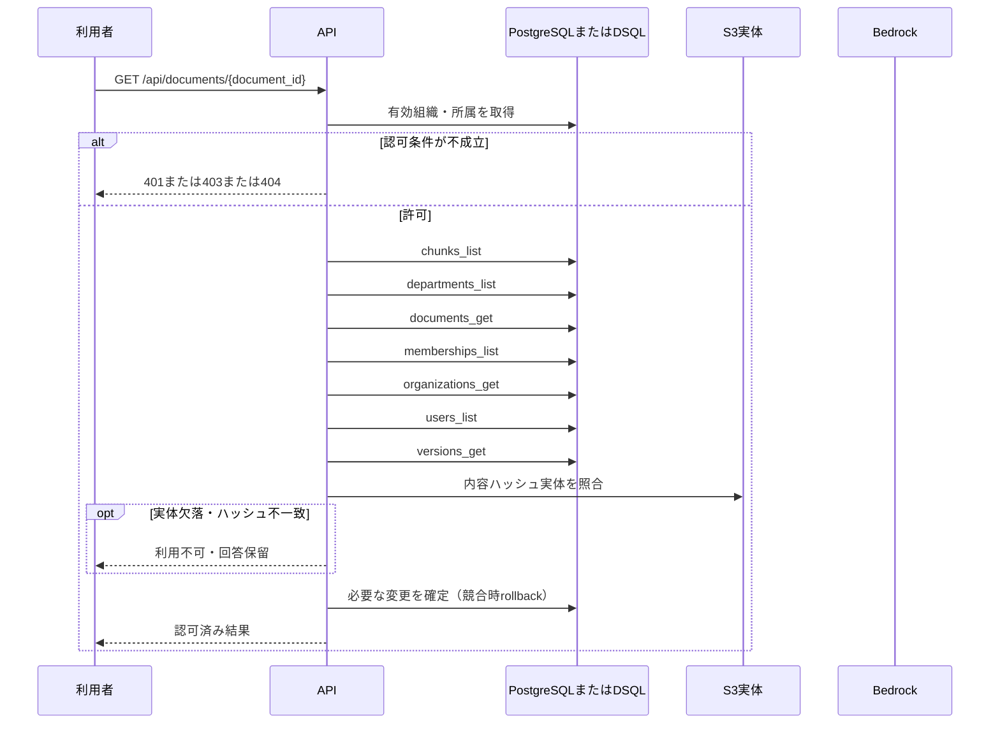

<!-- 実装から生成。直接編集しない。入力SHA256: 209f2912c47883d8fdc722aafdde6cf403dff105c2efced6770337a06a320dd2 -->

# 承認版または担当版を表示 — sequence

## 制御順序（関数内の行順）

| 関数 | 行 | 要素 | 条件・早期終了・例外 |
| --- | --- | --- | --- |
| kotorelay.context.Context.can_read | 70 | If | doc.status != 'active' or not self.memberships |
| kotorelay.context.Context.can_read | 71 | Return | False |
| kotorelay.context.Context.can_read | 72 | If | doc.visibility == 'organization' |
| kotorelay.context.Context.can_read | 73 | Return | True |
| kotorelay.context.Context.can_read | 74 | If | self.member(doc.department_id) |
| kotorelay.context.Context.can_read | 75 | Return | True |
| kotorelay.context.Context.can_read | 76 | Return | doc.visibility == 'selected' and any((self.member(department) for department in json.loads(doc.shared_departments))) |
| kotorelay.context.Context.permission | 59 | For | For |
| kotorelay.context.Context.permission | 60 | If | m.department_id == department_id |
| kotorelay.context.Context.permission | 61 | Return | {'author': m.can_author, 'review': m.can_review, 'manage': m.leader, 'draft': m.can_author or m.can_review}.get(operation, False) |
| kotorelay.context.Context.permission | 67 | Return | False |
| kotorelay.context.Context.version | 96 | If | not self.permission(doc.department_id, 'draft') |
| kotorelay.context.Context.version | 100 | Return | version |
| kotorelay.errors.require | 13 | If | not condition |
| kotorelay.errors.require | 14 | Raise | Raise |
| kotorelay.objects.digest | 17 | Return | hashlib.sha256(data).hexdigest() |
| kotorelay.operations.documents.functions.read_version | 272 | Return | {'document': doc.model_copy(update={'title': version.title}), 'version': version, 'body': ctx.objects.get(version.body_key, version.body_hash).decode(), 'index_ready': any((c.version_id == version.id and c.ready for c in q.chunks_list(ctx.db, ctx.org)))} |
| kotorelay.operations.documents.router.read_document | 61 | Return | f.read_version(ctx, str(document_id), str(version_id) if version_id else None) |
