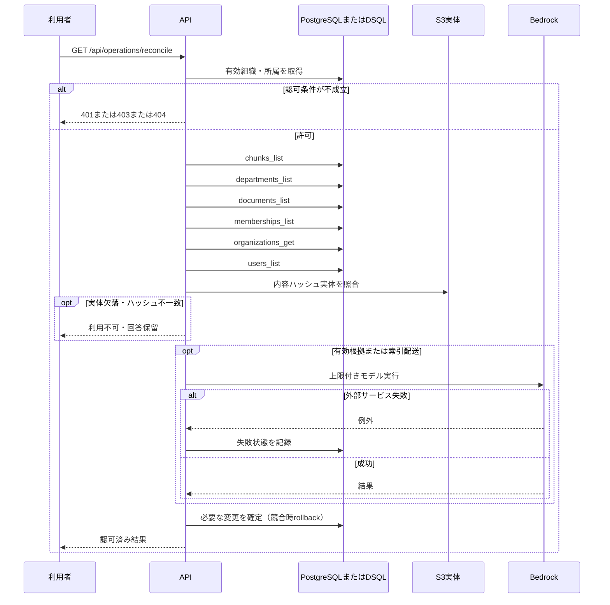

<!-- 実装から生成。直接編集しない。入力SHA256: 209f2912c47883d8fdc722aafdde6cf403dff105c2efced6770337a06a320dd2 -->

# 正本と索引の不一致を確認 — sequence

## 制御順序（関数内の行順）

| 関数 | 行 | 要素 | 条件・早期終了・例外 |
| --- | --- | --- | --- |
| kotorelay.errors.require | 13 | If | not condition |
| kotorelay.errors.require | 14 | Raise | Raise |
| kotorelay.operations.indexing.functions.reconcile | 221 | For | For |
| kotorelay.operations.indexing.functions.reconcile | 223 | If | any((c.version_id != doc.latest_version_id or doc.status != 'active' for c in current)) |
| kotorelay.operations.indexing.functions.reconcile | 225 | If | doc.status == 'active' and doc.latest_version_id and (not any((c.version_id == doc.latest_version_id and c.ready for c in current))) |
| kotorelay.operations.indexing.functions.reconcile | 231 | Return | differences |
| kotorelay.operations.indexing.router.reconcile_index | 26 | Return | f.reconcile(ctx) |
