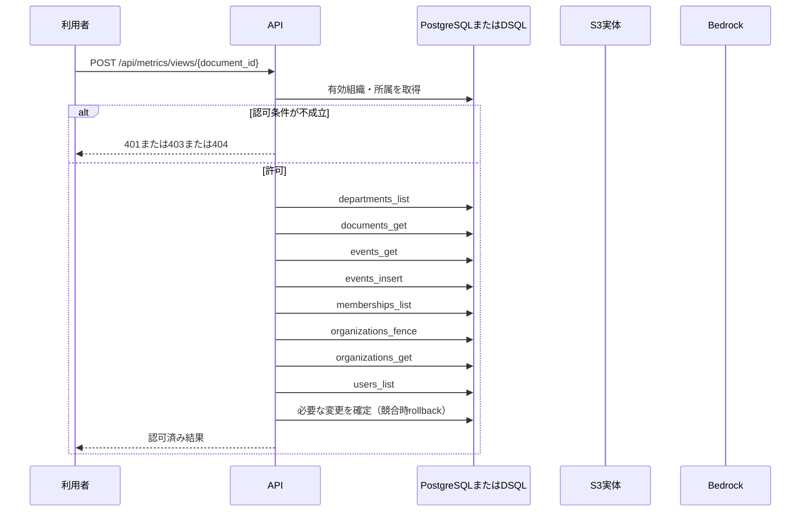

<!-- 実装から生成。直接編集しない。入力SHA256: 8ddb6b8d66f674570acb431243c0b3f3887134895acc19f3980f35e395ebe090 -->

# 実閲覧を一意IDで記録 — sequence

## 制御順序（関数内の行順）

| 関数 | 行 | 要素 | 条件・早期終了・例外 |
| --- | --- | --- | --- |
| kotorelay.context.Context.document | 90 | Return | doc |
| kotorelay.context.Context.member | 56 | Return | any((m.department_id == department_id for m in self.memberships)) |
| kotorelay.context.now | 18 | Return | datetime.now(UTC) |
| kotorelay.context.stable_id | 26 | Return | str(uuid5(NAMESPACE_URL, 'kotorelay:' + value)) |
| kotorelay.errors.require | 13 | If | not condition |
| kotorelay.errors.require | 14 | Raise | Raise |
| kotorelay.operations.metrics.functions.view | 18 | If | previous |
| kotorelay.operations.metrics.functions.view | 26 | Return | {'recorded': False} |
| kotorelay.operations.metrics.functions.view | 42 | Return | {'recorded': True} |
| kotorelay.operations.metrics.router.record_view | 17 | Return | f.view(ctx, str(document_id), data) |
