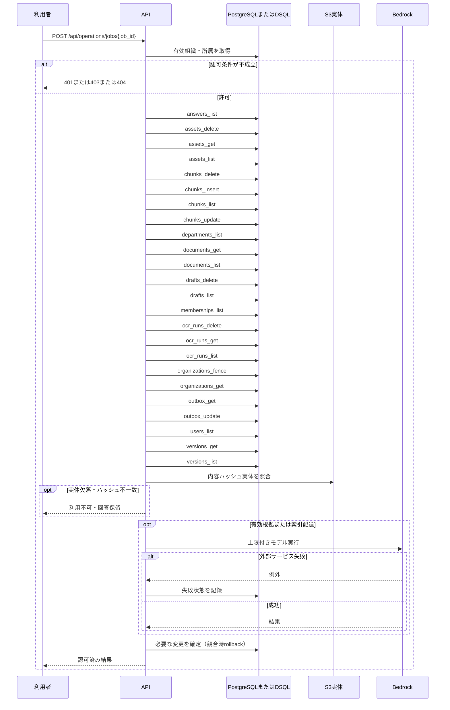

<!-- 実装から生成。直接編集しない。入力SHA256: e3cb305ddf380bd9917bab7f5404c8ac54c8511b8d91b58e7192aa0d5991c3cf -->

# 反映ジョブを再処理 — sequence

## 制御順序（関数内の行順）

| 関数 | 行 | 要素 | 条件・早期終了・例外 |
| --- | --- | --- | --- |
| kotorelay.context.now | 18 | Return | datetime.now(UTC) |
| kotorelay.context.stable_id | 26 | Return | str(uuid5(NAMESPACE_URL, 'kotorelay:' + value)) |
| kotorelay.errors.require | 13 | If | not condition |
| kotorelay.errors.require | 14 | Raise | Raise |
| kotorelay.operations.indexing.functions.build_index | 40 | If | doc.latest_version_id != job.version_id or not job.version_id |
| kotorelay.operations.indexing.functions.build_index | 41 | Return | 'obsolete' |
| kotorelay.operations.indexing.functions.build_index | 48 | For | For |
| kotorelay.operations.indexing.functions.build_index | 50 | If | len(stale) > 100 |
| kotorelay.operations.indexing.functions.build_index | 51 | Return | 'pending' |
| kotorelay.operations.indexing.functions.build_index | 52 | If | doc.status != 'active' |
| kotorelay.operations.indexing.functions.build_index | 53 | Return | 'done' |
| kotorelay.operations.indexing.functions.build_index | 60 | For | For |
| kotorelay.operations.indexing.functions.build_index | 66 | For | For |
| kotorelay.operations.indexing.functions.build_index | 72 | For | For |
| kotorelay.operations.indexing.functions.build_index | 87 | If | chunk.id in previous |
| kotorelay.operations.indexing.functions.build_index | 93 | For | For |
| kotorelay.operations.indexing.functions.build_index | 96 | Return | 'done' |
| kotorelay.operations.indexing.functions.process | 170 | If | job.status in {'done', 'obsolete'} |
| kotorelay.operations.indexing.functions.process | 171 | Return | job |
| kotorelay.operations.indexing.functions.process | 172 | Try | Try |
| kotorelay.operations.indexing.functions.process | 181 | ExceptHandler | Problem |
| kotorelay.operations.indexing.functions.process | 185 | ExceptHandler | (OSError, BotoCoreError, ClientError) |
| kotorelay.operations.indexing.functions.process | 195 | Return | updated |
| kotorelay.operations.indexing.functions.purge | 101 | If | doc.status != 'deleted' |
| kotorelay.operations.indexing.functions.purge | 102 | Return | 'obsolete' |
| kotorelay.operations.indexing.functions.purge | 103 | If | (now() - job.created_at).total_seconds() < ctx.settings.retention_days * 86400 |
| kotorelay.operations.indexing.functions.purge | 104 | Return | 'retained' |
| kotorelay.operations.indexing.functions.purge | 130 | For | For |
| kotorelay.operations.indexing.functions.purge | 131 | For | For |
| kotorelay.operations.indexing.functions.purge | 132 | If | row.document_id == doc.id |
| kotorelay.operations.indexing.functions.purge | 134 | If | row.document_id in live |
| kotorelay.operations.indexing.functions.purge | 136 | For | For |
| kotorelay.operations.indexing.functions.purge | 142 | For | For |
| kotorelay.operations.indexing.functions.purge | 146 | For | For |
| kotorelay.operations.indexing.functions.purge | 148 | If | len(target_chunks) > 100 |
| kotorelay.operations.indexing.functions.purge | 149 | Return | 'pending' |
| kotorelay.operations.indexing.functions.purge | 151 | For | For |
| kotorelay.operations.indexing.functions.purge | 153 | If | len(target_runs) > 100 |
| kotorelay.operations.indexing.functions.purge | 154 | Return | 'pending' |
| kotorelay.operations.indexing.functions.purge | 155 | For | For |
| kotorelay.operations.indexing.functions.purge | 156 | If | asset.document_id == doc.id |
| kotorelay.operations.indexing.functions.purge | 158 | For | For |
| kotorelay.operations.indexing.functions.purge | 159 | If | draft.document_id == doc.id |
| kotorelay.operations.indexing.functions.purge | 161 | Return | 'done' |
| kotorelay.operations.indexing.functions.split_chunks | 20 | For | For |
| kotorelay.operations.indexing.functions.split_chunks | 21 | If | line.startswith('#') or len(buffer) + len(line) > 1200 |
| kotorelay.operations.indexing.functions.split_chunks | 22 | If | buffer.strip() |
| kotorelay.operations.indexing.functions.split_chunks | 25 | If | line.startswith('#') |
| kotorelay.operations.indexing.functions.split_chunks | 27 | For | For |
| kotorelay.operations.indexing.functions.split_chunks | 29 | If | len(buffer) + len(part) > 1200 and buffer.strip() |
| kotorelay.operations.indexing.functions.split_chunks | 33 | If | buffer.strip() |
| kotorelay.operations.indexing.functions.split_chunks | 35 | Return | chunks |
| kotorelay.operations.indexing.router.retry_job | 21 | Return | f.process(ctx, rt.engine, str(job_id)) |
