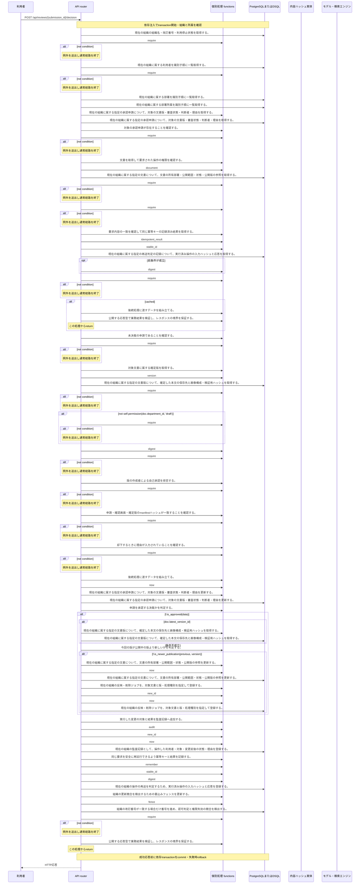

<!-- 実装から生成。直接編集しない。入力SHA256: 1c655589065a087f66d0ae05a6e0b777b889337ba2d8cca7542a2988c7248164 -->

# manifestを確認して承認・却下 — シーケンス

章構成: [lazunex API帳票](https://github.com/tsuji-tomonori/lazunex/tree/096e1e580ab1c0670c57e4febad2bd9fdd4698ee/docs/spec/40.apis)。

**制御順序（関数内の行順）**

| 関数 | 行 | 要素 | 条件・早期終了・例外 |
| --- | --- | --- | --- |
| kotorelay.context.Context.document | 111 | Return | doc |
| kotorelay.context.Context.idempotent_result | 153 | If | not rows |
| kotorelay.context.Context.idempotent_result | 154 | Return | None |
| kotorelay.context.Context.idempotent_result | 161 | Return | record.response |
| kotorelay.context.Context.version | 117 | If | not self.permission(doc.department_id, 'draft') |
| kotorelay.context.Context.version | 121 | Return | version |
| kotorelay.context.new_id | 23 | Return | str(uuid4()) |
| kotorelay.context.now | 19 | Return | datetime.now(UTC) |
| kotorelay.context.stable_id | 27 | Return | str(uuid5(NAMESPACE_URL, 'kotorelay:' + value)) |
| kotorelay.errors.require | 13 | If | not condition |
| kotorelay.errors.require | 14 | Raise | Raise |
| kotorelay.objects.digest | 17 | Return | hashlib.sha256(data).hexdigest() |
| kotorelay.operations.reviews.decide_review.functions.build_decide_review | 43 | Return | models.SubmissionsRow.model_validate_json(cached) |
| kotorelay.operations.reviews.decide_review.functions.build_updated | 81 | Return | submission.model_copy(update={'status': data.decision, 'reason': data.reason, 'decided_by': ctx.user.id, 'decided_at': now()}) |
| kotorelay.operations.reviews.decide_review.functions.check_concurrent_access | 173 | Return | ctx.fence() |
| kotorelay.operations.reviews.decide_review.functions.document_doc | 33 | Return | ctx.document(submission.document_id, 'review') |
| kotorelay.operations.reviews.decide_review.functions.documents_update | 117 | Return | q.documents_update(ctx.db, q.DocumentsUpdateParams.model_validate(doc.model_copy(update={'latest_version_id': version.id, 'revision': doc.revision + 1, 'updated_at': now()}), from_attributes=True)) |
| kotorelay.operations.reviews.decide_review.functions.find_previous_result | 38 | Return | ctx.idempotent_result(str(key), 'decide', request) |
| kotorelay.operations.reviews.decide_review.functions.is_approved | 100 | Return | bool(data.decision == 'approved') |
| kotorelay.operations.reviews.decide_review.functions.is_newer_publication | 110 | Return | bool(not previous or previous[0].number < version.number) |
| kotorelay.operations.reviews.decide_review.functions.outbox_insert | 136 | Return | q.outbox_insert(ctx.db, q.OutboxInsertParams(id=new_id(), organization_id=ctx.org, document_id=doc.id, version_id=version.id, kind='index', status='pending', attempts=0, error_code='', created_at=now())) |
| kotorelay.operations.reviews.decide_review.functions.prevent_self_approval | 60 | Return | require(version.created_by != ctx.user.id, 'self_approval', 403) |
| kotorelay.operations.reviews.decide_review.functions.record_decide_review_audit | 161 | Return | ctx.audit('review', doc.id, version.id, submission.status, updated.status, data.reason) |
| kotorelay.operations.reviews.decide_review.functions.remember_decide_review_result | 168 | Return | ctx.remember(str(key), 'decide', request, updated.model_dump_json()) |
| kotorelay.operations.reviews.decide_review.functions.require_pending_submission | 48 | Return | require(submission.status == 'pending', 'conflict', 409) |
| kotorelay.operations.reviews.decide_review.functions.require_rejection_reason | 74 | Return | require(data.decision != 'rejected' or bool(data.reason.strip()), 'reason_required', 422) |
| kotorelay.operations.reviews.decide_review.functions.require_submission | 26 | Return | require(bool(rows)) |
| kotorelay.operations.reviews.decide_review.functions.submissions_get | 19 | Return | q.submissions_get(ctx.db, q.SubmissionsGetParams(organization_id=ctx.org, id=str(submission_id))) |
| kotorelay.operations.reviews.decide_review.functions.submissions_update | 93 | Return | q.submissions_update(ctx.db, q.SubmissionsUpdateParams.model_validate(updated, from_attributes=True)) |
| kotorelay.operations.reviews.decide_review.functions.validate_manifest_hash | 67 | Return | require(submission.manifest_hash == data.manifest_hash == version.manifest_hash, 'conflict', 409) |
| kotorelay.operations.reviews.decide_review.functions.version_version | 55 | Return | ctx.version(doc, submission.version_id) |
| kotorelay.operations.reviews.decide_review.functions.versions_get | 105 | Return | q.versions_get(ctx.db, q.VersionsGetParams(organization_id=ctx.org, id=version_id)) |
| kotorelay.operations.reviews.decide_review.response_builders.build_response | 10 | Return | TypeAdapter(ResponseData).validate_python(value) |
| kotorelay.operations.reviews.decide_review.router.decide_review | 34 | If | cached |
| kotorelay.operations.reviews.decide_review.router.decide_review | 35 | Return | build_response(f.build_decide_review(cached)) |
| kotorelay.operations.reviews.decide_review.router.decide_review | 43 | If | f.is_approved(data) |
| kotorelay.operations.reviews.decide_review.router.decide_review | 45 | If | f.is_newer_publication(previous, version) |
| kotorelay.operations.reviews.decide_review.router.decide_review | 51 | Return | build_response(updated) |
