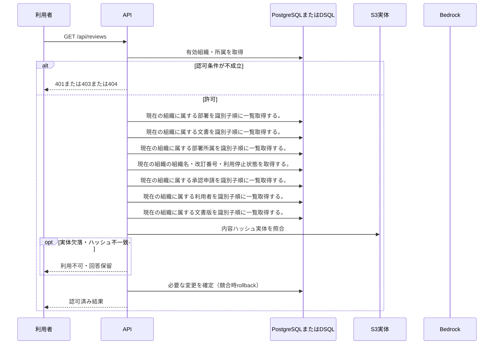

<!-- 実装から生成。直接編集しない。入力SHA256: 31de213f242d3d7bf0d4f5957d4ef327aaacb2267a973d8e0adce1f1531ac7e1 -->

# 審査状況を一覧 — シーケンス

章構成: [lazunex API帳票](https://github.com/tsuji-tomonori/lazunex/tree/096e1e580ab1c0670c57e4febad2bd9fdd4698ee/docs/spec/40.apis)。

**制御順序（関数内の行順）**

| 関数 | 行 | 要素 | 条件・早期終了・例外 |
| --- | --- | --- | --- |
| kotorelay.context.Context.permission | 59 | For | For |
| kotorelay.context.Context.permission | 60 | If | m.department_id == department_id |
| kotorelay.context.Context.permission | 61 | Return | {'author': m.can_author, 'review': m.can_review, 'manage': m.leader, 'draft': m.can_author or m.can_review}.get(operation, False) |
| kotorelay.context.Context.permission | 67 | Return | False |
| kotorelay.errors.require | 13 | If | not condition |
| kotorelay.errors.require | 14 | Raise | Raise |
| kotorelay.operations.reviews.functions.list_reviews | 21 | Return | [{'submission': s, 'title': versions[s.version_id].title, 'version_number': versions[s.version_id].number, 'requested_by': users[s.requested_by], 'department_name': departments[documents[s.document_id].department_id], 'self_requested': s.requested_by == ctx.user.id, 'can_review': ctx.permission(documents[s.document_id].department_id, 'review')} for s in q.submissions_list(ctx.db, ctx.org) if s.document_id in documents] |
| kotorelay.operations.reviews.router.list_reviews | 18 | Return | f.list_reviews(ctx) |
