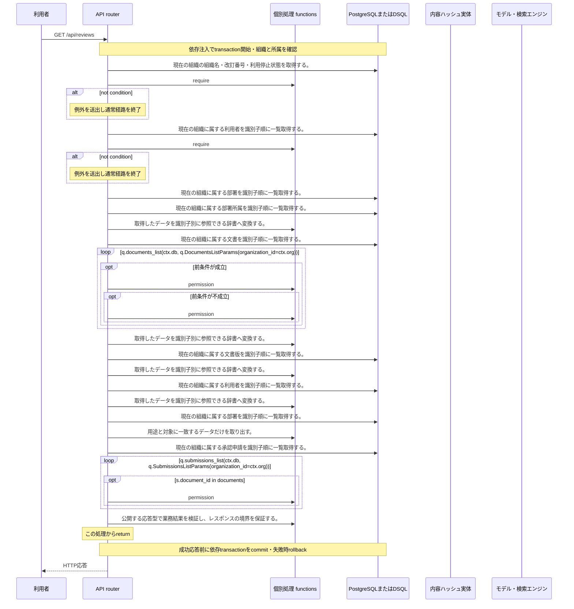

<!-- 実装から生成。直接編集しない。入力SHA256: 1c655589065a087f66d0ae05a6e0b777b889337ba2d8cca7542a2988c7248164 -->

# 審査状況を一覧 — シーケンス

章構成: [lazunex API帳票](https://github.com/tsuji-tomonori/lazunex/tree/096e1e580ab1c0670c57e4febad2bd9fdd4698ee/docs/spec/40.apis)。

**制御順序（関数内の行順）**

| 関数 | 行 | 要素 | 条件・早期終了・例外 |
| --- | --- | --- | --- |
| kotorelay.context.Context.permission | 78 | For | For |
| kotorelay.context.Context.permission | 79 | If | m.department_id == department_id |
| kotorelay.context.Context.permission | 80 | Return | {'author': m.can_author, 'review': m.can_review, 'manage': m.leader, 'draft': m.can_author or m.can_review}.get(operation, False) |
| kotorelay.context.Context.permission | 86 | Return | False |
| kotorelay.errors.require | 13 | If | not condition |
| kotorelay.errors.require | 14 | Raise | Raise |
| kotorelay.operations.reviews.list_reviews.functions.map_departments | 34 | Return | {d.id: d.name for d in q.departments_list(ctx.db, q.DepartmentsListParams(organization_id=ctx.org))} |
| kotorelay.operations.reviews.list_reviews.functions.map_documents | 11 | Return | {d.id: d for d in q.documents_list(ctx.db, q.DocumentsListParams(organization_id=ctx.org)) if d.status != 'deleted' and (ctx.permission(d.department_id, 'review') or ctx.permission(d.department_id, 'manage'))} |
| kotorelay.operations.reviews.list_reviews.functions.map_users | 26 | Return | {u.id: u.display_name for u in q.users_list(ctx.db, q.UsersListParams(organization_id=ctx.org))} |
| kotorelay.operations.reviews.list_reviews.functions.map_versions | 21 | Return | {v.id: v for v in q.versions_list(ctx.db, q.VersionsListParams(organization_id=ctx.org))} |
| kotorelay.operations.reviews.list_reviews.functions.select_list_reviews | 48 | Return | [{'submission': s, 'title': versions[s.version_id].title, 'version_number': versions[s.version_id].number, 'requested_by': users[s.requested_by], 'department_name': departments[documents[s.document_id].department_id], 'self_requested': s.requested_by == ctx.user.id, 'can_review': ctx.permission(documents[s.document_id].department_id, 'review')} for s in q.submissions_list(ctx.db, q.SubmissionsListParams(organization_id=ctx.org)) if s.document_id in documents] |
| kotorelay.operations.reviews.list_reviews.response_builders.build_response | 10 | Return | TypeAdapter(ResponseData).validate_python(value) |
| kotorelay.operations.reviews.list_reviews.router.list_reviews | 27 | Return | build_response(f.select_list_reviews(users, departments, documents, versions, ctx)) |
