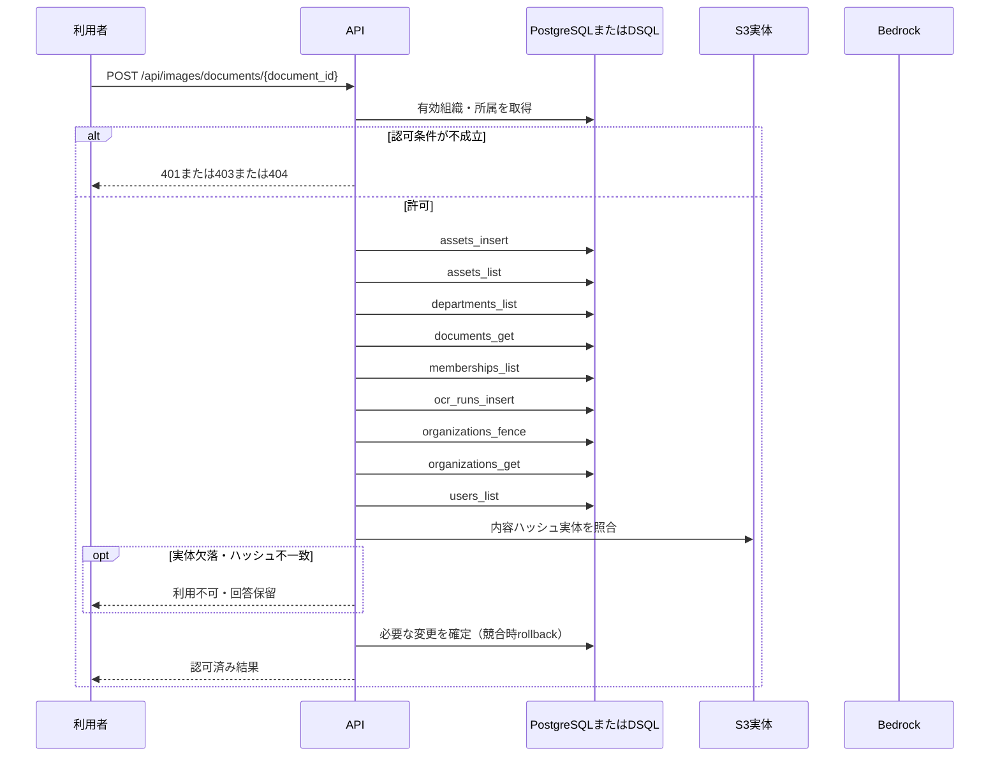

<!-- 実装から生成。直接編集しない。入力SHA256: e3cb305ddf380bd9917bab7f5404c8ac54c8511b8d91b58e7192aa0d5991c3cf -->

# 画像を添付して位置付きOCRを実行 — sequence

## 制御順序（関数内の行順）

| 関数 | 行 | 要素 | 条件・早期終了・例外 |
| --- | --- | --- | --- |
| kotorelay.context.Context.document | 90 | Return | doc |
| kotorelay.context.new_id | 22 | Return | str(uuid4()) |
| kotorelay.context.now | 18 | Return | datetime.now(UTC) |
| kotorelay.errors.require | 13 | If | not condition |
| kotorelay.errors.require | 14 | Raise | Raise |
| kotorelay.operations.images.functions.normalize_image | 21 | Try | Try |
| kotorelay.operations.images.functions.normalize_image | 35 | Return | (value, image.width, image.height) |
| kotorelay.operations.images.functions.normalize_image | 36 | ExceptHandler | (UnidentifiedImageError, OSError, Image.DecompressionBombError) |
| kotorelay.operations.images.functions.normalize_image | 37 | Raise | Raise |
| kotorelay.operations.images.functions.run_ocr | 44 | Try | Try |
| kotorelay.operations.images.functions.run_ocr | 51 | ExceptHandler | (OSError, subprocess.TimeoutExpired, subprocess.CalledProcessError) |
| kotorelay.operations.images.functions.run_ocr | 52 | Return | OcrResult(regions=[], engine='tesseract-jpn-eng-v1', status='failed') |
| kotorelay.operations.images.functions.run_ocr | 54 | For | For |
| kotorelay.operations.images.functions.run_ocr | 56 | If | text |
| kotorelay.operations.images.functions.run_ocr | 68 | Return | OcrResult(regions=regions, engine='tesseract-jpn-eng-v1', status='ready') |
| kotorelay.operations.images.functions.upload | 108 | Return | {'asset': asset, 'ocr_run': run, 'ocr': result} |
| kotorelay.operations.images.router.upload_image | 22 | Return | f.upload(ctx, str(document_id), file.file.read(ctx.settings.max_image_bytes + 1)) |
