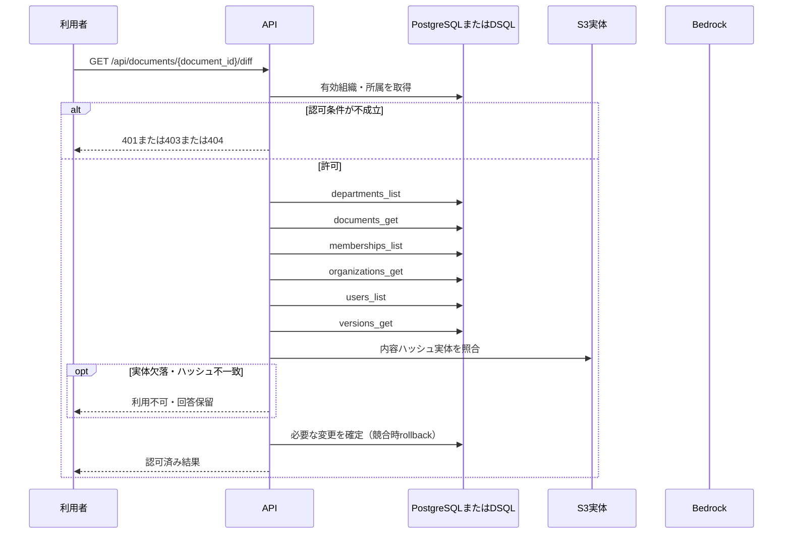

<!-- 実装から生成。直接編集しない。入力SHA256: 209f2912c47883d8fdc722aafdde6cf403dff105c2efced6770337a06a320dd2 -->

# 版IDを指定して本文差分を比較 — sequence

## 制御順序（関数内の行順）

| 関数 | 行 | 要素 | 条件・早期終了・例外 |
| --- | --- | --- | --- |
| kotorelay.context.Context.document | 90 | Return | doc |
| kotorelay.context.Context.version | 96 | If | not self.permission(doc.department_id, 'draft') |
| kotorelay.context.Context.version | 100 | Return | version |
| kotorelay.errors.require | 13 | If | not condition |
| kotorelay.errors.require | 14 | Raise | Raise |
| kotorelay.objects.digest | 17 | Return | hashlib.sha256(data).hexdigest() |
| kotorelay.operations.documents.functions.diff | 302 | Return | {'left': left, 'right': right, 'diff': '\n'.join(lines)} |
| kotorelay.operations.documents.router.version_diff | 73 | Return | f.diff(ctx, str(document_id), str(left), str(right)) |
