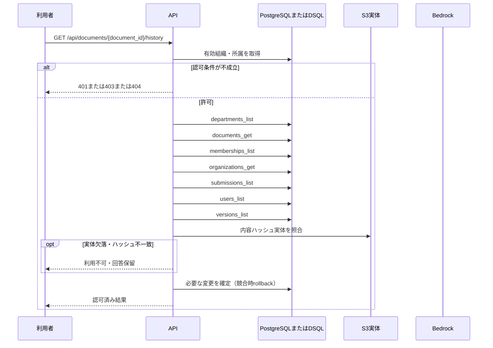

<!-- 実装から生成。直接編集しない。入力SHA256: 209f2912c47883d8fdc722aafdde6cf403dff105c2efced6770337a06a320dd2 -->

# 担当文書の版履歴 — sequence

## 制御順序（関数内の行順）

| 関数 | 行 | 要素 | 条件・早期終了・例外 |
| --- | --- | --- | --- |
| kotorelay.context.Context.document | 90 | Return | doc |
| kotorelay.errors.require | 13 | If | not condition |
| kotorelay.errors.require | 14 | Raise | Raise |
| kotorelay.operations.documents.functions.history | 285 | Return | [{'version': v, 'submission': submissions.get(v.id)} for v in sorted(q.versions_list(ctx.db, ctx.org), key=lambda v: v.number, reverse=True) if v.document_id == doc.id] |
| kotorelay.operations.documents.router.version_history | 66 | Return | f.history(ctx, str(document_id)) |
