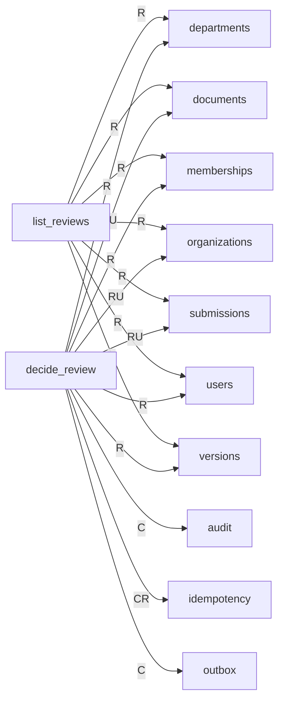
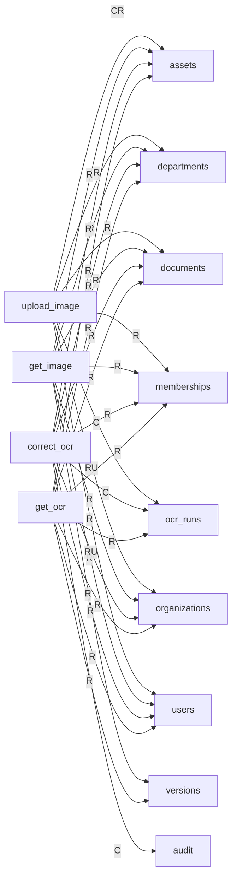
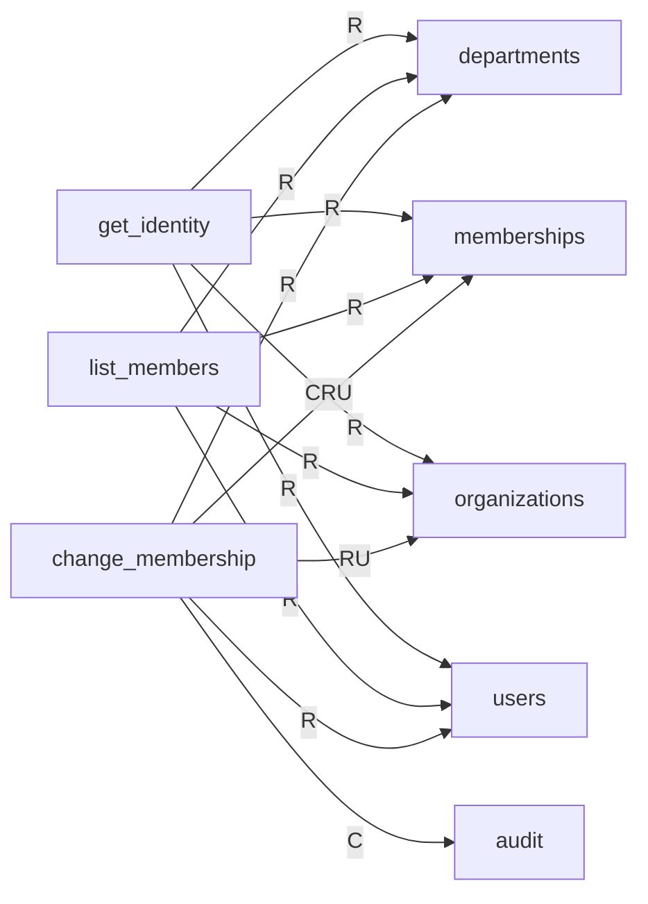
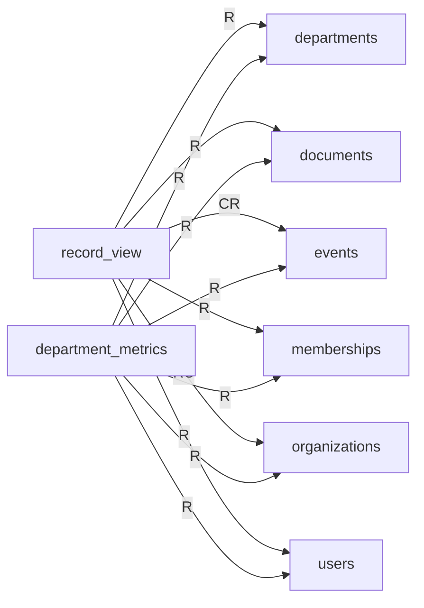
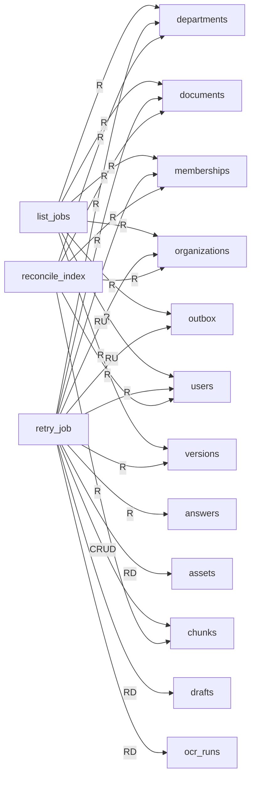
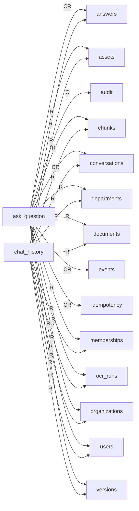

<!-- 実装から生成。直接編集しない。入力SHA256: 4c18ae62a9b9de513581947abfc60f1ec45b9f631019a142a812724b4695a84b -->

# DB CRUD対応表

[参照構成](https://github.com/tsuji-tomonori/lazunex/tree/096e1e580ab1c0670c57e4febad2bd9fdd4698ee/docs/spec/30.crud)。C=作成、R=参照、U=更新、D=削除。条件分岐を含む到達可能な呼出しの静的な和集合です。全操作が毎回実行される意味ではありません。S3のputとvectorのindexは上書きを含むためCUとします。Bedrockの生成呼出しはCRUDに含めません。

| API | answers | assets | audit | chunks | conversations | departments | documents | drafts | events | idempotency | memberships | ocr_runs | organizations | outbox | submissions | users | versions |
| --- | --- | --- | --- | --- | --- | --- | --- | --- | --- | --- | --- | --- | --- | --- | --- | --- | --- |
| ask_question | CR | R | C | R | CR | R | R | — | CR | CR | R | R | RU | — | — | R | R |
| change_membership | — | — | C | — | — | R | — | — | — | — | CRU | — | RU | — | — | R | — |
| change_policy | — | — | C | — | — | R | RU | — | — | — | R | — | RU | C | — | R | — |
| chat_history | R | R | — | R | R | R | R | — | — | — | R | R | R | — | — | R | R |
| correct_ocr | — | R | C | — | — | R | R | — | — | — | R | C | RU | — | — | R | — |
| create_document | — | — | C | — | — | R | C | C | — | — | R | — | RU | — | — | R | — |
| decide_review | — | — | C | — | — | R | RU | — | — | CR | R | — | RU | C | RU | R | R |
| department_metrics | — | — | — | — | — | R | R | — | R | — | R | — | R | — | — | R | — |
| get_draft | — | — | — | — | — | R | R | R | — | — | R | — | R | — | — | R | — |
| get_identity | — | — | — | — | — | R | — | — | — | — | R | — | R | — | — | R | — |
| get_image | — | R | — | — | — | R | R | — | — | — | R | — | R | — | — | R | R |
| get_ocr | — | R | — | — | — | R | R | — | — | — | R | R | R | — | — | R | R |
| health | — | — | — | — | — | — | — | — | — | — | — | — | — | — | — | — | — |
| list_documents | — | — | — | R | — | R | R | — | — | — | R | — | R | — | R | R | R |
| list_jobs | — | — | — | — | — | R | R | — | — | — | R | — | R | R | — | R | R |
| list_members | — | — | — | — | — | R | — | — | — | — | R | — | R | — | — | R | — |
| list_reviews | — | — | — | — | — | R | R | — | — | — | R | — | R | — | R | R | R |
| read_document | — | — | — | R | — | R | R | — | — | — | R | — | R | — | — | R | R |
| reconcile_index | — | — | — | R | — | R | R | — | — | — | R | — | R | — | — | R | — |
| record_view | — | — | — | — | — | R | R | — | CR | — | R | — | RU | — | — | R | — |
| retry_job | R | RD | — | CRUD | — | R | R | RD | — | — | R | RD | RU | RU | — | R | R |
| save_draft | — | R | — | — | — | R | RU | RU | — | — | R | R | RU | — | — | R | — |
| submit_version | — | R | C | — | — | R | RU | R | — | CR | R | R | RU | — | C | R | C |
| upload_image | — | CR | — | — | — | R | R | — | — | — | R | C | RU | — | — | R | — |
| version_diff | — | — | — | — | — | R | R | — | — | — | R | — | R | — | — | R | R |
| version_history | — | — | — | — | — | R | R | — | — | — | R | — | R | — | R | R | R |

## APIグループ: health

この保存先へのアクセスはありません。

## APIグループ: documents

```mermaid
flowchart LR
    A0["list_documents"] -->|R| R3["chunks"]
    A0["list_documents"] -->|R| R5["departments"]
    A0["list_documents"] -->|R| R6["documents"]
    A0["list_documents"] -->|R| R10["memberships"]
    A0["list_documents"] -->|R| R12["organizations"]
    A0["list_documents"] -->|R| R14["submissions"]
    A0["list_documents"] -->|R| R15["users"]
    A0["list_documents"] -->|R| R16["versions"]
    A1["create_document"] -->|C| R2["audit"]
    A1["create_document"] -->|R| R5["departments"]
    A1["create_document"] -->|C| R6["documents"]
    A1["create_document"] -->|C| R7["drafts"]
    A1["create_document"] -->|R| R10["memberships"]
    A1["create_document"] -->|RU| R12["organizations"]
    A1["create_document"] -->|R| R15["users"]
    A2["get_draft"] -->|R| R5["departments"]
    A2["get_draft"] -->|R| R6["documents"]
    A2["get_draft"] -->|R| R7["drafts"]
    A2["get_draft"] -->|R| R10["memberships"]
    A2["get_draft"] -->|R| R12["organizations"]
    A2["get_draft"] -->|R| R15["users"]
    A3["save_draft"] -->|R| R1["assets"]
    A3["save_draft"] -->|R| R5["departments"]
    A3["save_draft"] -->|RU| R6["documents"]
    A3["save_draft"] -->|RU| R7["drafts"]
    A3["save_draft"] -->|R| R10["memberships"]
    A3["save_draft"] -->|R| R11["ocr_runs"]
    A3["save_draft"] -->|RU| R12["organizations"]
    A3["save_draft"] -->|R| R15["users"]
    A4["submit_version"] -->|R| R1["assets"]
    A4["submit_version"] -->|C| R2["audit"]
    A4["submit_version"] -->|R| R5["departments"]
    A4["submit_version"] -->|RU| R6["documents"]
    A4["submit_version"] -->|R| R7["drafts"]
    A4["submit_version"] -->|CR| R9["idempotency"]
    A4["submit_version"] -->|R| R10["memberships"]
    A4["submit_version"] -->|R| R11["ocr_runs"]
    A4["submit_version"] -->|RU| R12["organizations"]
    A4["submit_version"] -->|C| R14["submissions"]
    A4["submit_version"] -->|R| R15["users"]
    A4["submit_version"] -->|C| R16["versions"]
    A5["read_document"] -->|R| R3["chunks"]
    A5["read_document"] -->|R| R5["departments"]
    A5["read_document"] -->|R| R6["documents"]
    A5["read_document"] -->|R| R10["memberships"]
    A5["read_document"] -->|R| R12["organizations"]
    A5["read_document"] -->|R| R15["users"]
    A5["read_document"] -->|R| R16["versions"]
    A6["version_history"] -->|R| R5["departments"]
    A6["version_history"] -->|R| R6["documents"]
    A6["version_history"] -->|R| R10["memberships"]
    A6["version_history"] -->|R| R12["organizations"]
    A6["version_history"] -->|R| R14["submissions"]
    A6["version_history"] -->|R| R15["users"]
    A6["version_history"] -->|R| R16["versions"]
    A7["version_diff"] -->|R| R5["departments"]
    A7["version_diff"] -->|R| R6["documents"]
    A7["version_diff"] -->|R| R10["memberships"]
    A7["version_diff"] -->|R| R12["organizations"]
    A7["version_diff"] -->|R| R15["users"]
    A7["version_diff"] -->|R| R16["versions"]
    A8["change_policy"] -->|C| R2["audit"]
    A8["change_policy"] -->|R| R5["departments"]
    A8["change_policy"] -->|RU| R6["documents"]
    A8["change_policy"] -->|R| R10["memberships"]
    A8["change_policy"] -->|RU| R12["organizations"]
    A8["change_policy"] -->|C| R13["outbox"]
    A8["change_policy"] -->|R| R15["users"]
```

## APIグループ: reviews

## APIグループ: images

## APIグループ: groups

## APIグループ: metrics

## APIグループ: operations

## APIグループ: chat

## 抽出根拠

| API | 保存先 | リソース | CRUD | SQL正本／呼出箇所 |
| --- | --- | --- | --- | --- |
| list_documents | DB | chunks | R | backend/src/kotorelay/operations/indexing/sql/chunks_list.sql |
| list_documents | DB | departments | R | backend/src/kotorelay/operations/groups/sql/departments_list.sql |
| list_documents | DB | documents | R | backend/src/kotorelay/operations/documents/sql/documents_by_department.sql |
| list_documents | DB | documents | R | backend/src/kotorelay/operations/documents/sql/documents_list.sql |
| list_documents | DB | memberships | R | backend/src/kotorelay/operations/groups/sql/memberships_list.sql |
| list_documents | DB | organizations | R | backend/src/kotorelay/operations/identity/sql/organizations_get.sql |
| list_documents | DB | submissions | R | backend/src/kotorelay/operations/reviews/sql/submissions_list.sql |
| list_documents | DB | users | R | backend/src/kotorelay/operations/identity/sql/users_list.sql |
| list_documents | DB | versions | R | backend/src/kotorelay/operations/documents/sql/versions_list.sql |
| create_document | DB | audit | C | backend/src/kotorelay/operations/system/sql/audit_insert.sql |
| create_document | DB | departments | R | backend/src/kotorelay/operations/groups/sql/departments_list.sql |
| create_document | DB | documents | C | backend/src/kotorelay/operations/documents/sql/documents_insert.sql |
| create_document | DB | drafts | C | backend/src/kotorelay/operations/documents/sql/drafts_insert.sql |
| create_document | DB | memberships | R | backend/src/kotorelay/operations/groups/sql/memberships_list.sql |
| create_document | DB | organizations | U | backend/src/kotorelay/operations/identity/sql/organizations_fence.sql |
| create_document | DB | organizations | R | backend/src/kotorelay/operations/identity/sql/organizations_get.sql |
| create_document | DB | users | R | backend/src/kotorelay/operations/identity/sql/users_list.sql |
| get_draft | DB | departments | R | backend/src/kotorelay/operations/groups/sql/departments_list.sql |
| get_draft | DB | documents | R | backend/src/kotorelay/operations/documents/sql/documents_get.sql |
| get_draft | DB | drafts | R | backend/src/kotorelay/operations/documents/sql/drafts_list.sql |
| get_draft | DB | memberships | R | backend/src/kotorelay/operations/groups/sql/memberships_list.sql |
| get_draft | DB | organizations | R | backend/src/kotorelay/operations/identity/sql/organizations_get.sql |
| get_draft | DB | users | R | backend/src/kotorelay/operations/identity/sql/users_list.sql |
| save_draft | DB | assets | R | backend/src/kotorelay/operations/images/sql/assets_get.sql |
| save_draft | DB | departments | R | backend/src/kotorelay/operations/groups/sql/departments_list.sql |
| save_draft | DB | documents | R | backend/src/kotorelay/operations/documents/sql/documents_get.sql |
| save_draft | DB | documents | U | backend/src/kotorelay/operations/documents/sql/documents_update.sql |
| save_draft | DB | drafts | R | backend/src/kotorelay/operations/documents/sql/drafts_list.sql |
| save_draft | DB | drafts | U | backend/src/kotorelay/operations/documents/sql/drafts_update.sql |
| save_draft | DB | memberships | R | backend/src/kotorelay/operations/groups/sql/memberships_list.sql |
| save_draft | DB | ocr_runs | R | backend/src/kotorelay/operations/images/sql/ocr_runs_get.sql |
| save_draft | DB | organizations | U | backend/src/kotorelay/operations/identity/sql/organizations_fence.sql |
| save_draft | DB | organizations | R | backend/src/kotorelay/operations/identity/sql/organizations_get.sql |
| save_draft | DB | users | R | backend/src/kotorelay/operations/identity/sql/users_list.sql |
| submit_version | DB | assets | R | backend/src/kotorelay/operations/images/sql/assets_get.sql |
| submit_version | DB | audit | C | backend/src/kotorelay/operations/system/sql/audit_insert.sql |
| submit_version | DB | departments | R | backend/src/kotorelay/operations/groups/sql/departments_list.sql |
| submit_version | DB | documents | R | backend/src/kotorelay/operations/documents/sql/documents_get.sql |
| submit_version | DB | documents | U | backend/src/kotorelay/operations/documents/sql/documents_update.sql |
| submit_version | DB | drafts | R | backend/src/kotorelay/operations/documents/sql/drafts_list.sql |
| submit_version | DB | idempotency | R | backend/src/kotorelay/operations/system/sql/idempotency_get.sql |
| submit_version | DB | idempotency | C | backend/src/kotorelay/operations/system/sql/idempotency_insert.sql |
| submit_version | DB | memberships | R | backend/src/kotorelay/operations/groups/sql/memberships_list.sql |
| submit_version | DB | ocr_runs | R | backend/src/kotorelay/operations/images/sql/ocr_runs_get.sql |
| submit_version | DB | organizations | U | backend/src/kotorelay/operations/identity/sql/organizations_fence.sql |
| submit_version | DB | organizations | R | backend/src/kotorelay/operations/identity/sql/organizations_get.sql |
| submit_version | DB | submissions | C | backend/src/kotorelay/operations/reviews/sql/submissions_insert.sql |
| submit_version | DB | users | R | backend/src/kotorelay/operations/identity/sql/users_list.sql |
| submit_version | DB | versions | C | backend/src/kotorelay/operations/documents/sql/versions_insert.sql |
| read_document | DB | chunks | R | backend/src/kotorelay/operations/indexing/sql/chunks_list.sql |
| read_document | DB | departments | R | backend/src/kotorelay/operations/groups/sql/departments_list.sql |
| read_document | DB | documents | R | backend/src/kotorelay/operations/documents/sql/documents_get.sql |
| read_document | DB | memberships | R | backend/src/kotorelay/operations/groups/sql/memberships_list.sql |
| read_document | DB | organizations | R | backend/src/kotorelay/operations/identity/sql/organizations_get.sql |
| read_document | DB | users | R | backend/src/kotorelay/operations/identity/sql/users_list.sql |
| read_document | DB | versions | R | backend/src/kotorelay/operations/documents/sql/versions_get.sql |
| version_history | DB | departments | R | backend/src/kotorelay/operations/groups/sql/departments_list.sql |
| version_history | DB | documents | R | backend/src/kotorelay/operations/documents/sql/documents_get.sql |
| version_history | DB | memberships | R | backend/src/kotorelay/operations/groups/sql/memberships_list.sql |
| version_history | DB | organizations | R | backend/src/kotorelay/operations/identity/sql/organizations_get.sql |
| version_history | DB | submissions | R | backend/src/kotorelay/operations/reviews/sql/submissions_list.sql |
| version_history | DB | users | R | backend/src/kotorelay/operations/identity/sql/users_list.sql |
| version_history | DB | versions | R | backend/src/kotorelay/operations/documents/sql/versions_list.sql |
| version_diff | DB | departments | R | backend/src/kotorelay/operations/groups/sql/departments_list.sql |
| version_diff | DB | documents | R | backend/src/kotorelay/operations/documents/sql/documents_get.sql |
| version_diff | DB | memberships | R | backend/src/kotorelay/operations/groups/sql/memberships_list.sql |
| version_diff | DB | organizations | R | backend/src/kotorelay/operations/identity/sql/organizations_get.sql |
| version_diff | DB | users | R | backend/src/kotorelay/operations/identity/sql/users_list.sql |
| version_diff | DB | versions | R | backend/src/kotorelay/operations/documents/sql/versions_get.sql |
| change_policy | DB | audit | C | backend/src/kotorelay/operations/system/sql/audit_insert.sql |
| change_policy | DB | departments | R | backend/src/kotorelay/operations/groups/sql/departments_list.sql |
| change_policy | DB | documents | R | backend/src/kotorelay/operations/documents/sql/documents_get.sql |
| change_policy | DB | documents | U | backend/src/kotorelay/operations/documents/sql/documents_update.sql |
| change_policy | DB | memberships | R | backend/src/kotorelay/operations/groups/sql/memberships_list.sql |
| change_policy | DB | organizations | U | backend/src/kotorelay/operations/identity/sql/organizations_fence.sql |
| change_policy | DB | organizations | R | backend/src/kotorelay/operations/identity/sql/organizations_get.sql |
| change_policy | DB | outbox | C | backend/src/kotorelay/operations/indexing/sql/outbox_insert.sql |
| change_policy | DB | users | R | backend/src/kotorelay/operations/identity/sql/users_list.sql |
| list_reviews | DB | departments | R | backend/src/kotorelay/operations/groups/sql/departments_list.sql |
| list_reviews | DB | documents | R | backend/src/kotorelay/operations/documents/sql/documents_list.sql |
| list_reviews | DB | memberships | R | backend/src/kotorelay/operations/groups/sql/memberships_list.sql |
| list_reviews | DB | organizations | R | backend/src/kotorelay/operations/identity/sql/organizations_get.sql |
| list_reviews | DB | submissions | R | backend/src/kotorelay/operations/reviews/sql/submissions_list.sql |
| list_reviews | DB | users | R | backend/src/kotorelay/operations/identity/sql/users_list.sql |
| list_reviews | DB | versions | R | backend/src/kotorelay/operations/documents/sql/versions_list.sql |
| decide_review | DB | audit | C | backend/src/kotorelay/operations/system/sql/audit_insert.sql |
| decide_review | DB | departments | R | backend/src/kotorelay/operations/groups/sql/departments_list.sql |
| decide_review | DB | documents | R | backend/src/kotorelay/operations/documents/sql/documents_get.sql |
| decide_review | DB | documents | U | backend/src/kotorelay/operations/documents/sql/documents_update.sql |
| decide_review | DB | idempotency | R | backend/src/kotorelay/operations/system/sql/idempotency_get.sql |
| decide_review | DB | idempotency | C | backend/src/kotorelay/operations/system/sql/idempotency_insert.sql |
| decide_review | DB | memberships | R | backend/src/kotorelay/operations/groups/sql/memberships_list.sql |
| decide_review | DB | organizations | U | backend/src/kotorelay/operations/identity/sql/organizations_fence.sql |
| decide_review | DB | organizations | R | backend/src/kotorelay/operations/identity/sql/organizations_get.sql |
| decide_review | DB | outbox | C | backend/src/kotorelay/operations/indexing/sql/outbox_insert.sql |
| decide_review | DB | submissions | R | backend/src/kotorelay/operations/reviews/sql/submissions_get.sql |
| decide_review | DB | submissions | U | backend/src/kotorelay/operations/reviews/sql/submissions_update.sql |
| decide_review | DB | users | R | backend/src/kotorelay/operations/identity/sql/users_list.sql |
| decide_review | DB | versions | R | backend/src/kotorelay/operations/documents/sql/versions_get.sql |
| upload_image | DB | assets | C | backend/src/kotorelay/operations/images/sql/assets_insert.sql |
| upload_image | DB | assets | R | backend/src/kotorelay/operations/images/sql/assets_list.sql |
| upload_image | DB | departments | R | backend/src/kotorelay/operations/groups/sql/departments_list.sql |
| upload_image | DB | documents | R | backend/src/kotorelay/operations/documents/sql/documents_get.sql |
| upload_image | DB | memberships | R | backend/src/kotorelay/operations/groups/sql/memberships_list.sql |
| upload_image | DB | ocr_runs | C | backend/src/kotorelay/operations/images/sql/ocr_runs_insert.sql |
| upload_image | DB | organizations | U | backend/src/kotorelay/operations/identity/sql/organizations_fence.sql |
| upload_image | DB | organizations | R | backend/src/kotorelay/operations/identity/sql/organizations_get.sql |
| upload_image | DB | users | R | backend/src/kotorelay/operations/identity/sql/users_list.sql |
| get_image | DB | assets | R | backend/src/kotorelay/operations/images/sql/assets_get.sql |
| get_image | DB | departments | R | backend/src/kotorelay/operations/groups/sql/departments_list.sql |
| get_image | DB | documents | R | backend/src/kotorelay/operations/documents/sql/documents_get.sql |
| get_image | DB | memberships | R | backend/src/kotorelay/operations/groups/sql/memberships_list.sql |
| get_image | DB | organizations | R | backend/src/kotorelay/operations/identity/sql/organizations_get.sql |
| get_image | DB | users | R | backend/src/kotorelay/operations/identity/sql/users_list.sql |
| get_image | DB | versions | R | backend/src/kotorelay/operations/documents/sql/versions_get.sql |
| correct_ocr | DB | assets | R | backend/src/kotorelay/operations/images/sql/assets_get.sql |
| correct_ocr | DB | audit | C | backend/src/kotorelay/operations/system/sql/audit_insert.sql |
| correct_ocr | DB | departments | R | backend/src/kotorelay/operations/groups/sql/departments_list.sql |
| correct_ocr | DB | documents | R | backend/src/kotorelay/operations/documents/sql/documents_get.sql |
| correct_ocr | DB | memberships | R | backend/src/kotorelay/operations/groups/sql/memberships_list.sql |
| correct_ocr | DB | ocr_runs | C | backend/src/kotorelay/operations/images/sql/ocr_runs_insert.sql |
| correct_ocr | DB | organizations | U | backend/src/kotorelay/operations/identity/sql/organizations_fence.sql |
| correct_ocr | DB | organizations | R | backend/src/kotorelay/operations/identity/sql/organizations_get.sql |
| correct_ocr | DB | users | R | backend/src/kotorelay/operations/identity/sql/users_list.sql |
| get_ocr | DB | assets | R | backend/src/kotorelay/operations/images/sql/assets_get.sql |
| get_ocr | DB | departments | R | backend/src/kotorelay/operations/groups/sql/departments_list.sql |
| get_ocr | DB | documents | R | backend/src/kotorelay/operations/documents/sql/documents_get.sql |
| get_ocr | DB | memberships | R | backend/src/kotorelay/operations/groups/sql/memberships_list.sql |
| get_ocr | DB | ocr_runs | R | backend/src/kotorelay/operations/images/sql/ocr_runs_get.sql |
| get_ocr | DB | organizations | R | backend/src/kotorelay/operations/identity/sql/organizations_get.sql |
| get_ocr | DB | users | R | backend/src/kotorelay/operations/identity/sql/users_list.sql |
| get_ocr | DB | versions | R | backend/src/kotorelay/operations/documents/sql/versions_get.sql |
| get_identity | DB | departments | R | backend/src/kotorelay/operations/groups/sql/departments_list.sql |
| get_identity | DB | memberships | R | backend/src/kotorelay/operations/groups/sql/memberships_list.sql |
| get_identity | DB | organizations | R | backend/src/kotorelay/operations/identity/sql/organizations_get.sql |
| get_identity | DB | users | R | backend/src/kotorelay/operations/identity/sql/users_list.sql |
| list_members | DB | departments | R | backend/src/kotorelay/operations/groups/sql/departments_list.sql |
| list_members | DB | memberships | R | backend/src/kotorelay/operations/groups/sql/memberships_list.sql |
| list_members | DB | organizations | R | backend/src/kotorelay/operations/identity/sql/organizations_get.sql |
| list_members | DB | users | R | backend/src/kotorelay/operations/identity/sql/users_list.sql |
| change_membership | DB | audit | C | backend/src/kotorelay/operations/system/sql/audit_insert.sql |
| change_membership | DB | departments | R | backend/src/kotorelay/operations/groups/sql/departments_get.sql |
| change_membership | DB | departments | R | backend/src/kotorelay/operations/groups/sql/departments_list.sql |
| change_membership | DB | memberships | C | backend/src/kotorelay/operations/groups/sql/memberships_insert.sql |
| change_membership | DB | memberships | R | backend/src/kotorelay/operations/groups/sql/memberships_list.sql |
| change_membership | DB | memberships | U | backend/src/kotorelay/operations/groups/sql/memberships_update.sql |
| change_membership | DB | organizations | U | backend/src/kotorelay/operations/identity/sql/organizations_fence.sql |
| change_membership | DB | organizations | R | backend/src/kotorelay/operations/identity/sql/organizations_get.sql |
| change_membership | DB | users | R | backend/src/kotorelay/operations/identity/sql/users_get.sql |
| change_membership | DB | users | R | backend/src/kotorelay/operations/identity/sql/users_list.sql |
| record_view | DB | departments | R | backend/src/kotorelay/operations/groups/sql/departments_list.sql |
| record_view | DB | documents | R | backend/src/kotorelay/operations/documents/sql/documents_get.sql |
| record_view | DB | events | R | backend/src/kotorelay/operations/metrics/sql/events_get.sql |
| record_view | DB | events | C | backend/src/kotorelay/operations/metrics/sql/events_insert.sql |
| record_view | DB | memberships | R | backend/src/kotorelay/operations/groups/sql/memberships_list.sql |
| record_view | DB | organizations | U | backend/src/kotorelay/operations/identity/sql/organizations_fence.sql |
| record_view | DB | organizations | R | backend/src/kotorelay/operations/identity/sql/organizations_get.sql |
| record_view | DB | users | R | backend/src/kotorelay/operations/identity/sql/users_list.sql |
| department_metrics | DB | departments | R | backend/src/kotorelay/operations/groups/sql/departments_list.sql |
| department_metrics | DB | documents | R | backend/src/kotorelay/operations/documents/sql/documents_list.sql |
| department_metrics | DB | events | R | backend/src/kotorelay/operations/metrics/sql/events_list.sql |
| department_metrics | DB | memberships | R | backend/src/kotorelay/operations/groups/sql/memberships_list.sql |
| department_metrics | DB | organizations | R | backend/src/kotorelay/operations/identity/sql/organizations_get.sql |
| department_metrics | DB | users | R | backend/src/kotorelay/operations/identity/sql/users_list.sql |
| list_jobs | DB | departments | R | backend/src/kotorelay/operations/groups/sql/departments_list.sql |
| list_jobs | DB | documents | R | backend/src/kotorelay/operations/documents/sql/documents_list.sql |
| list_jobs | DB | memberships | R | backend/src/kotorelay/operations/groups/sql/memberships_list.sql |
| list_jobs | DB | organizations | R | backend/src/kotorelay/operations/identity/sql/organizations_get.sql |
| list_jobs | DB | outbox | R | backend/src/kotorelay/operations/indexing/sql/outbox_list.sql |
| list_jobs | DB | users | R | backend/src/kotorelay/operations/identity/sql/users_list.sql |
| list_jobs | DB | versions | R | backend/src/kotorelay/operations/documents/sql/versions_list.sql |
| retry_job | DB | answers | R | backend/src/kotorelay/operations/chat/sql/answers_list.sql |
| retry_job | DB | assets | D | backend/src/kotorelay/operations/images/sql/assets_delete.sql |
| retry_job | DB | assets | R | backend/src/kotorelay/operations/images/sql/assets_get.sql |
| retry_job | DB | assets | R | backend/src/kotorelay/operations/images/sql/assets_list.sql |
| retry_job | DB | chunks | D | backend/src/kotorelay/operations/indexing/sql/chunks_delete.sql |
| retry_job | DB | chunks | C | backend/src/kotorelay/operations/indexing/sql/chunks_insert.sql |
| retry_job | DB | chunks | R | backend/src/kotorelay/operations/indexing/sql/chunks_list.sql |
| retry_job | DB | chunks | U | backend/src/kotorelay/operations/indexing/sql/chunks_update.sql |
| retry_job | DB | departments | R | backend/src/kotorelay/operations/groups/sql/departments_list.sql |
| retry_job | DB | documents | R | backend/src/kotorelay/operations/documents/sql/documents_get.sql |
| retry_job | DB | documents | R | backend/src/kotorelay/operations/documents/sql/documents_list.sql |
| retry_job | DB | drafts | D | backend/src/kotorelay/operations/documents/sql/drafts_delete.sql |
| retry_job | DB | drafts | R | backend/src/kotorelay/operations/documents/sql/drafts_list.sql |
| retry_job | DB | memberships | R | backend/src/kotorelay/operations/groups/sql/memberships_list.sql |
| retry_job | DB | ocr_runs | D | backend/src/kotorelay/operations/images/sql/ocr_runs_delete.sql |
| retry_job | DB | ocr_runs | R | backend/src/kotorelay/operations/images/sql/ocr_runs_get.sql |
| retry_job | DB | ocr_runs | R | backend/src/kotorelay/operations/images/sql/ocr_runs_list.sql |
| retry_job | DB | organizations | U | backend/src/kotorelay/operations/identity/sql/organizations_fence.sql |
| retry_job | DB | organizations | R | backend/src/kotorelay/operations/identity/sql/organizations_get.sql |
| retry_job | DB | outbox | R | backend/src/kotorelay/operations/indexing/sql/outbox_get.sql |
| retry_job | DB | outbox | U | backend/src/kotorelay/operations/indexing/sql/outbox_update.sql |
| retry_job | DB | users | R | backend/src/kotorelay/operations/identity/sql/users_list.sql |
| retry_job | DB | versions | R | backend/src/kotorelay/operations/documents/sql/versions_get.sql |
| retry_job | DB | versions | R | backend/src/kotorelay/operations/documents/sql/versions_list.sql |
| reconcile_index | DB | chunks | R | backend/src/kotorelay/operations/indexing/sql/chunks_list.sql |
| reconcile_index | DB | departments | R | backend/src/kotorelay/operations/groups/sql/departments_list.sql |
| reconcile_index | DB | documents | R | backend/src/kotorelay/operations/documents/sql/documents_list.sql |
| reconcile_index | DB | memberships | R | backend/src/kotorelay/operations/groups/sql/memberships_list.sql |
| reconcile_index | DB | organizations | R | backend/src/kotorelay/operations/identity/sql/organizations_get.sql |
| reconcile_index | DB | users | R | backend/src/kotorelay/operations/identity/sql/users_list.sql |
| ask_question | DB | answers | R | backend/src/kotorelay/operations/chat/sql/answers_get.sql |
| ask_question | DB | answers | C | backend/src/kotorelay/operations/chat/sql/answers_insert.sql |
| ask_question | DB | answers | R | backend/src/kotorelay/operations/chat/sql/answers_list.sql |
| ask_question | DB | assets | R | backend/src/kotorelay/operations/images/sql/assets_get.sql |
| ask_question | DB | audit | C | backend/src/kotorelay/operations/system/sql/audit_insert.sql |
| ask_question | DB | chunks | R | backend/src/kotorelay/operations/indexing/sql/chunks_get.sql |
| ask_question | DB | chunks | R | backend/src/kotorelay/operations/indexing/sql/chunks_list.sql |
| ask_question | DB | conversations | R | backend/src/kotorelay/operations/chat/sql/conversations_get.sql |
| ask_question | DB | conversations | C | backend/src/kotorelay/operations/chat/sql/conversations_insert.sql |
| ask_question | DB | departments | R | backend/src/kotorelay/operations/groups/sql/departments_list.sql |
| ask_question | DB | documents | R | backend/src/kotorelay/operations/documents/sql/documents_get.sql |
| ask_question | DB | documents | R | backend/src/kotorelay/operations/documents/sql/documents_list.sql |
| ask_question | DB | events | C | backend/src/kotorelay/operations/metrics/sql/events_insert.sql |
| ask_question | DB | events | R | backend/src/kotorelay/operations/metrics/sql/events_list.sql |
| ask_question | DB | idempotency | R | backend/src/kotorelay/operations/system/sql/idempotency_get.sql |
| ask_question | DB | idempotency | C | backend/src/kotorelay/operations/system/sql/idempotency_insert.sql |
| ask_question | DB | memberships | R | backend/src/kotorelay/operations/groups/sql/memberships_list.sql |
| ask_question | DB | ocr_runs | R | backend/src/kotorelay/operations/images/sql/ocr_runs_get.sql |
| ask_question | DB | organizations | U | backend/src/kotorelay/operations/identity/sql/organizations_fence.sql |
| ask_question | DB | organizations | R | backend/src/kotorelay/operations/identity/sql/organizations_get.sql |
| ask_question | DB | users | R | backend/src/kotorelay/operations/identity/sql/users_list.sql |
| ask_question | DB | versions | R | backend/src/kotorelay/operations/documents/sql/versions_get.sql |
| chat_history | DB | answers | R | backend/src/kotorelay/operations/chat/sql/answers_list.sql |
| chat_history | DB | assets | R | backend/src/kotorelay/operations/images/sql/assets_get.sql |
| chat_history | DB | chunks | R | backend/src/kotorelay/operations/indexing/sql/chunks_get.sql |
| chat_history | DB | conversations | R | backend/src/kotorelay/operations/chat/sql/conversations_get.sql |
| chat_history | DB | departments | R | backend/src/kotorelay/operations/groups/sql/departments_list.sql |
| chat_history | DB | documents | R | backend/src/kotorelay/operations/documents/sql/documents_get.sql |
| chat_history | DB | memberships | R | backend/src/kotorelay/operations/groups/sql/memberships_list.sql |
| chat_history | DB | ocr_runs | R | backend/src/kotorelay/operations/images/sql/ocr_runs_get.sql |
| chat_history | DB | organizations | R | backend/src/kotorelay/operations/identity/sql/organizations_get.sql |
| chat_history | DB | users | R | backend/src/kotorelay/operations/identity/sql/users_list.sql |
| chat_history | DB | versions | R | backend/src/kotorelay/operations/documents/sql/versions_get.sql |
