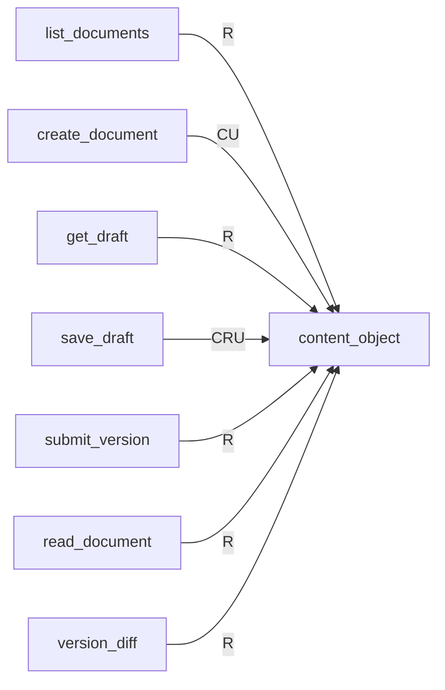
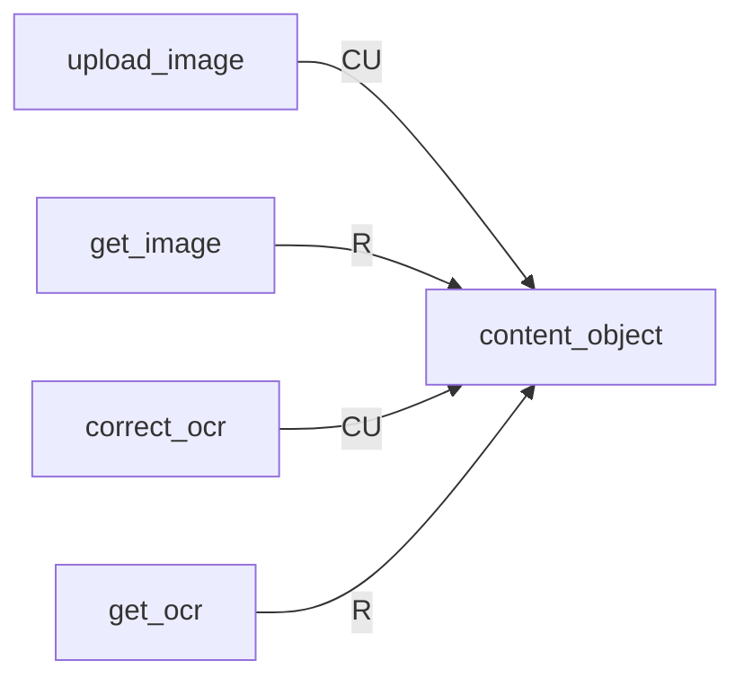
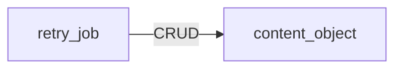
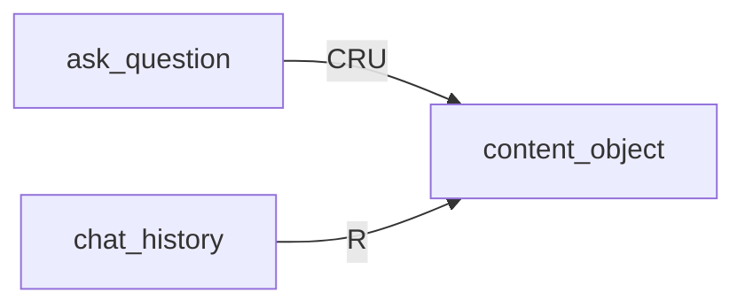

<!-- 実装から生成。直接編集しない。入力SHA256: 4c18ae62a9b9de513581947abfc60f1ec45b9f631019a142a812724b4695a84b -->

# オブジェクト保存 CRUD対応表

[参照構成](https://github.com/tsuji-tomonori/lazunex/tree/096e1e580ab1c0670c57e4febad2bd9fdd4698ee/docs/spec/30.crud)。C=作成、R=参照、U=更新、D=削除。条件分岐を含む到達可能な呼出しの静的な和集合です。全操作が毎回実行される意味ではありません。S3のputとvectorのindexは上書きを含むためCUとします。Bedrockの生成呼出しはCRUDに含めません。

| API | content_object |
| --- | --- |
| ask_question | CRU |
| change_membership | — |
| change_policy | — |
| chat_history | R |
| correct_ocr | CU |
| create_document | CU |
| decide_review | — |
| department_metrics | — |
| get_draft | R |
| get_identity | — |
| get_image | R |
| get_ocr | R |
| health | — |
| list_documents | R |
| list_jobs | — |
| list_members | — |
| list_reviews | — |
| read_document | R |
| reconcile_index | — |
| record_view | — |
| retry_job | CRUD |
| save_draft | CRU |
| submit_version | R |
| upload_image | CU |
| version_diff | R |
| version_history | — |

## APIグループ: health

この保存先へのアクセスはありません。

## APIグループ: documents

## APIグループ: reviews

この保存先へのアクセスはありません。

## APIグループ: images

## APIグループ: groups

この保存先へのアクセスはありません。

## APIグループ: metrics

この保存先へのアクセスはありません。

## APIグループ: operations

## APIグループ: chat

## 抽出根拠

| API | 保存先 | リソース | CRUD | SQL正本／呼出箇所 |
| --- | --- | --- | --- | --- |
| list_documents | objects | content_object | R | backend/src/kotorelay/operations/documents/functions.py:128 |
| create_document | objects | content_object | CU | backend/src/kotorelay/operations/documents/functions.py:40 |
| get_draft | objects | content_object | R | backend/src/kotorelay/operations/documents/functions.py:146 |
| save_draft | objects | content_object | R | backend/src/kotorelay/operations/documents/functions.py:146 |
| save_draft | objects | content_object | CU | backend/src/kotorelay/operations/documents/functions.py:173 |
| submit_version | objects | content_object | R | backend/src/kotorelay/operations/documents/functions.py:215 |
| submit_version | objects | content_object | R | backend/src/kotorelay/operations/documents/functions.py:210 |
| submit_version | objects | content_object | R | backend/src/kotorelay/operations/documents/functions.py:211 |
| read_document | objects | content_object | R | backend/src/kotorelay/operations/documents/functions.py:275 |
| version_diff | objects | content_object | R | backend/src/kotorelay/operations/documents/functions.py:296 |
| version_diff | objects | content_object | R | backend/src/kotorelay/operations/documents/functions.py:297 |
| upload_image | objects | content_object | CU | backend/src/kotorelay/operations/images/functions.py:81 |
| upload_image | objects | content_object | CU | backend/src/kotorelay/operations/images/functions.py:96 |
| get_image | objects | content_object | R | backend/src/kotorelay/operations/images/functions.py:181 |
| correct_ocr | objects | content_object | CU | backend/src/kotorelay/operations/images/functions.py:138 |
| get_ocr | objects | content_object | R | backend/src/kotorelay/operations/images/functions.py:198 |
| retry_job | objects | content_object | R | backend/src/kotorelay/operations/indexing/functions.py:63 |
| retry_job | objects | content_object | CU | backend/src/kotorelay/operations/indexing/functions.py:73 |
| retry_job | objects | content_object | R | backend/src/kotorelay/operations/indexing/functions.py:94 |
| retry_job | objects | content_object | R | backend/src/kotorelay/operations/indexing/functions.py:56 |
| retry_job | objects | content_object | R | backend/src/kotorelay/operations/indexing/functions.py:64 |
| retry_job | objects | content_object | D | backend/src/kotorelay/operations/indexing/functions.py:143 |
| ask_question | objects | content_object | CU | backend/src/kotorelay/operations/chat/functions.py:232 |
| ask_question | objects | content_object | CU | backend/src/kotorelay/operations/chat/functions.py:233 |
| ask_question | objects | content_object | R | backend/src/kotorelay/operations/chat/functions.py:181 |
| ask_question | objects | content_object | R | backend/src/kotorelay/operations/chat/functions.py:143 |
| ask_question | objects | content_object | R | backend/src/kotorelay/operations/chat/functions.py:81 |
| ask_question | objects | content_object | R | backend/src/kotorelay/operations/chat/functions.py:281 |
| ask_question | objects | content_object | R | backend/src/kotorelay/operations/chat/functions.py:282 |
| ask_question | objects | content_object | R | backend/src/kotorelay/operations/chat/functions.py:55 |
| ask_question | objects | content_object | R | backend/src/kotorelay/operations/chat/functions.py:56 |
| ask_question | objects | content_object | R | backend/src/kotorelay/operations/chat/functions.py:67 |
| ask_question | objects | content_object | R | backend/src/kotorelay/operations/chat/functions.py:68 |
| chat_history | objects | content_object | R | backend/src/kotorelay/operations/chat/functions.py:281 |
| chat_history | objects | content_object | R | backend/src/kotorelay/operations/chat/functions.py:282 |
| chat_history | objects | content_object | R | backend/src/kotorelay/operations/chat/functions.py:55 |
| chat_history | objects | content_object | R | backend/src/kotorelay/operations/chat/functions.py:56 |
| chat_history | objects | content_object | R | backend/src/kotorelay/operations/chat/functions.py:67 |
| chat_history | objects | content_object | R | backend/src/kotorelay/operations/chat/functions.py:68 |
