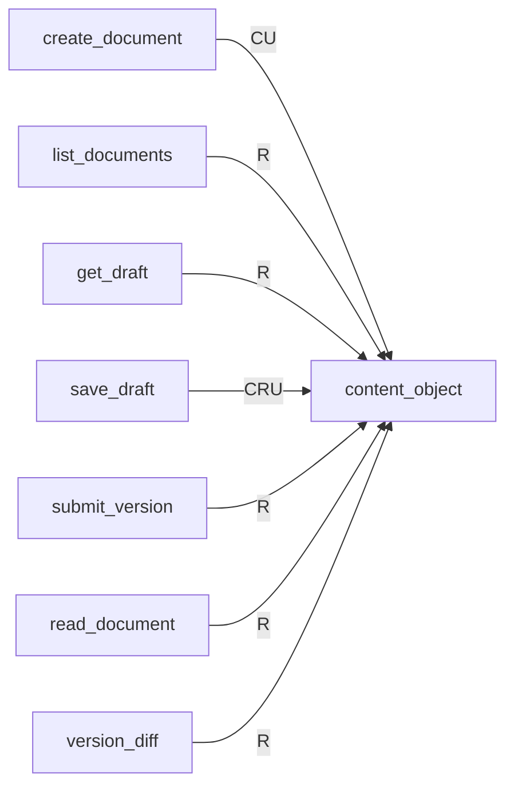
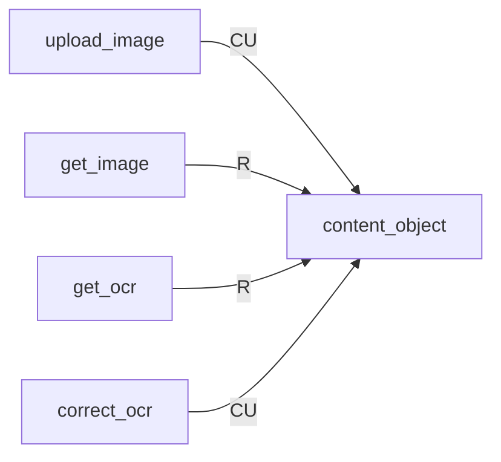
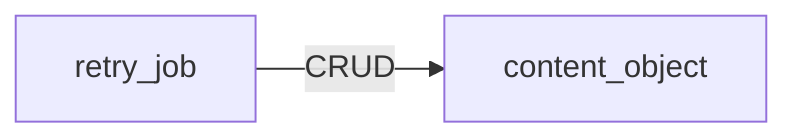
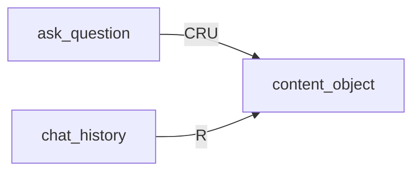

<!-- 実装から生成。直接編集しない。入力SHA256: 987c18a693c5fa5c9f59f732c65771f1c047c0829e22a5d72b689276aae93c56 -->

# オブジェクト保存 CRUD対応表

[参照構成](https://github.com/tsuji-tomonori/lazunex/tree/096e1e580ab1c0670c57e4febad2bd9fdd4698ee/docs/spec/30.crud)。C=作成、R=参照、U=更新、D=削除。条件分岐を含む到達可能な呼出しの静的な和集合です。全操作が毎回実行される意味ではありません。S3のputとvectorのindexは上書きを含むためCUとします。Bedrockの生成呼出しはCRUDに含めません。

| API | content_object |
| --- | --- |
| ask_question | CRU |
| change_membership | — |
| change_policy | — |
| chat_history | R |
| correct_ocr | CU |
| create_document | CU |
| decide_review | — |
| department_metrics | — |
| get_draft | R |
| get_identity | — |
| get_image | R |
| get_ocr | R |
| health | — |
| list_documents | R |
| list_jobs | — |
| list_members | — |
| list_reviews | — |
| read_document | R |
| reconcile_index | — |
| record_view | — |
| retry_job | CRUD |
| save_draft | CRU |
| submit_version | R |
| upload_image | CU |
| version_diff | R |
| version_history | — |

## APIグループ: health

この保存先へのアクセスはありません。

## APIグループ: documents

## APIグループ: reviews

この保存先へのアクセスはありません。

## APIグループ: images

## APIグループ: groups

この保存先へのアクセスはありません。

## APIグループ: metrics

この保存先へのアクセスはありません。

## APIグループ: operations

## APIグループ: chat

## 抽出根拠

| API | 保存先 | リソース | CRUD | SQL正本／呼出箇所 |
| --- | --- | --- | --- | --- |
| create_document | objects | content_object | CU | backend/src/kotorelay/operations/documents/create_document/functions.py:29 |
| list_documents | objects | content_object | R | backend/src/kotorelay/operations/documents/list_documents/functions.py:80 |
| get_draft | objects | content_object | R | backend/src/kotorelay/operations/documents/shared/functions.py:16 |
| save_draft | objects | content_object | CU | backend/src/kotorelay/operations/documents/save_draft/functions.py:20 |
| save_draft | objects | content_object | R | backend/src/kotorelay/operations/documents/shared/functions.py:16 |
| submit_version | objects | content_object | R | backend/src/kotorelay/operations/documents/submit_version/functions.py:35 |
| submit_version | objects | content_object | R | backend/src/kotorelay/operations/documents/submit_version/functions.py:30 |
| submit_version | objects | content_object | R | backend/src/kotorelay/operations/documents/submit_version/functions.py:31 |
| read_document | objects | content_object | R | backend/src/kotorelay/operations/documents/read_document/functions.py:22 |
| version_diff | objects | content_object | R | backend/src/kotorelay/operations/documents/version_diff/functions.py:14 |
| version_diff | objects | content_object | R | backend/src/kotorelay/operations/documents/version_diff/functions.py:15 |
| upload_image | objects | content_object | CU | backend/src/kotorelay/operations/images/upload_image/functions.py:27 |
| upload_image | objects | content_object | CU | backend/src/kotorelay/operations/images/upload_image/functions.py:42 |
| get_image | objects | content_object | R | backend/src/kotorelay/operations/images/get_image/functions.py:11 |
| get_ocr | objects | content_object | R | backend/src/kotorelay/operations/images/get_ocr/functions.py:26 |
| correct_ocr | objects | content_object | CU | backend/src/kotorelay/operations/images/correct_ocr/functions.py:37 |
| retry_job | objects | content_object | R | backend/src/kotorelay/operations/indexing/shared/functions.py:64 |
| retry_job | objects | content_object | CU | backend/src/kotorelay/operations/indexing/shared/functions.py:74 |
| retry_job | objects | content_object | R | backend/src/kotorelay/operations/indexing/shared/functions.py:95 |
| retry_job | objects | content_object | R | backend/src/kotorelay/operations/indexing/shared/functions.py:57 |
| retry_job | objects | content_object | R | backend/src/kotorelay/operations/indexing/shared/functions.py:65 |
| retry_job | objects | content_object | D | backend/src/kotorelay/operations/indexing/shared/functions.py:144 |
| ask_question | objects | content_object | CU | backend/src/kotorelay/operations/chat/ask_question/functions.py:190 |
| ask_question | objects | content_object | CU | backend/src/kotorelay/operations/chat/ask_question/functions.py:191 |
| ask_question | objects | content_object | R | backend/src/kotorelay/operations/chat/ask_question/functions.py:139 |
| ask_question | objects | content_object | R | backend/src/kotorelay/operations/chat/ask_question/functions.py:101 |
| ask_question | objects | content_object | R | backend/src/kotorelay/operations/chat/ask_question/functions.py:39 |
| ask_question | objects | content_object | R | backend/src/kotorelay/operations/chat/shared/functions.py:68 |
| ask_question | objects | content_object | R | backend/src/kotorelay/operations/chat/shared/functions.py:69 |
| ask_question | objects | content_object | R | backend/src/kotorelay/operations/chat/shared/functions.py:42 |
| ask_question | objects | content_object | R | backend/src/kotorelay/operations/chat/shared/functions.py:43 |
| ask_question | objects | content_object | R | backend/src/kotorelay/operations/chat/shared/functions.py:54 |
| ask_question | objects | content_object | R | backend/src/kotorelay/operations/chat/shared/functions.py:55 |
| chat_history | objects | content_object | R | backend/src/kotorelay/operations/chat/shared/functions.py:68 |
| chat_history | objects | content_object | R | backend/src/kotorelay/operations/chat/shared/functions.py:69 |
| chat_history | objects | content_object | R | backend/src/kotorelay/operations/chat/shared/functions.py:42 |
| chat_history | objects | content_object | R | backend/src/kotorelay/operations/chat/shared/functions.py:43 |
| chat_history | objects | content_object | R | backend/src/kotorelay/operations/chat/shared/functions.py:54 |
| chat_history | objects | content_object | R | backend/src/kotorelay/operations/chat/shared/functions.py:55 |
