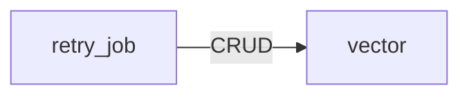

<!-- 実装から生成。直接編集しない。入力SHA256: 1c655589065a087f66d0ae05a6e0b777b889337ba2d8cca7542a2988c7248164 -->

# ベクトル索引 CRUD対応表

[参照構成](https://github.com/tsuji-tomonori/lazunex/tree/096e1e580ab1c0670c57e4febad2bd9fdd4698ee/docs/spec/30.crud)。C=作成、R=参照、U=更新、D=削除。条件分岐を含む到達可能な呼出しの静的な和集合です。全操作が毎回実行される意味ではありません。S3のputとvectorのindexは上書きを含むためCUとします。Bedrockの生成呼出しはCRUDに含めません。

| API | vector |
| --- | --- |
| ask_question | R |
| change_membership | — |
| change_policy | — |
| chat_history | — |
| correct_ocr | — |
| create_document | — |
| decide_review | — |
| department_metrics | — |
| get_draft | — |
| get_identity | — |
| get_image | — |
| get_ocr | — |
| health | — |
| list_documents | — |
| list_jobs | — |
| list_members | — |
| list_reviews | — |
| read_document | — |
| reconcile_index | — |
| record_view | — |
| retry_job | CRUD |
| save_draft | — |
| submit_version | — |
| upload_image | — |
| version_diff | — |
| version_history | — |

## APIグループ: health

この保存先へのアクセスはありません。

## APIグループ: documents

この保存先へのアクセスはありません。

## APIグループ: reviews

この保存先へのアクセスはありません。

## APIグループ: images

この保存先へのアクセスはありません。

## APIグループ: groups

この保存先へのアクセスはありません。

## APIグループ: metrics

この保存先へのアクセスはありません。

## APIグループ: operations

## APIグループ: chat

## 抽出根拠

| API | 保存先 | リソース | CRUD | SQL正本／呼出箇所 |
| --- | --- | --- | --- | --- |
| retry_job | vectors | vector | D | backend/src/kotorelay/operations/indexing/shared/functions.py:66 |
| retry_job | vectors | vector | D | backend/src/kotorelay/operations/indexing/shared/functions.py:310 |
| retry_job | vectors | vector | CU | backend/src/kotorelay/operations/indexing/shared/functions.py:189 |
| retry_job | vectors | vector | R | backend/src/kotorelay/operations/indexing/shared/functions.py:221 |
| ask_question | vectors | vector | R | backend/src/kotorelay/operations/chat/ask_question/functions.py:151 |
