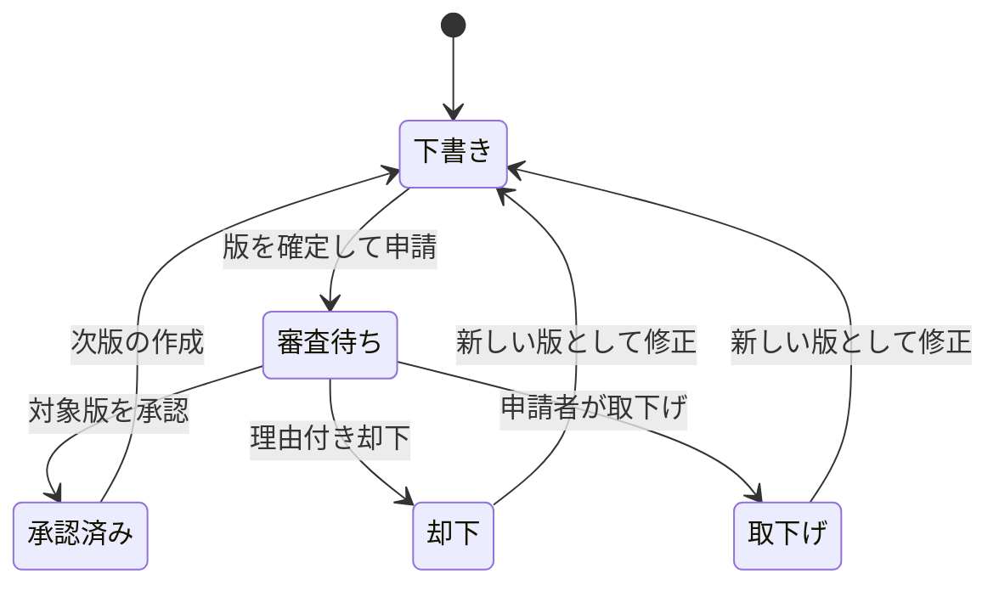
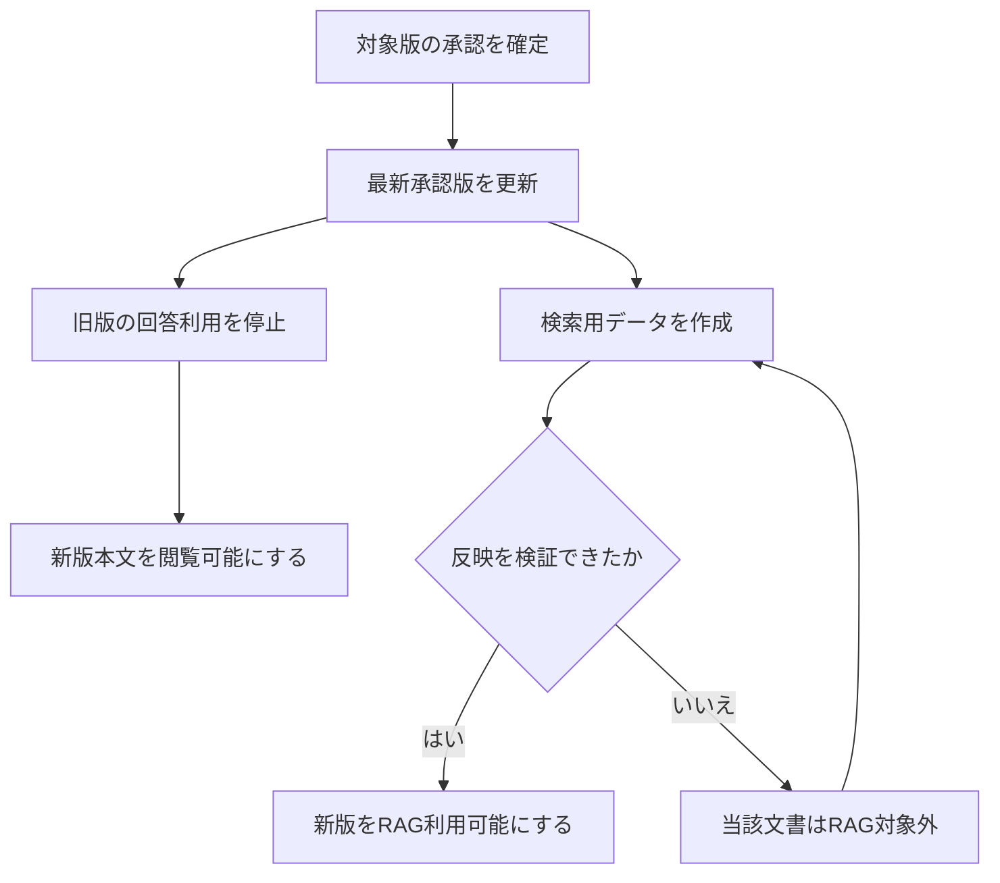

# KotoRelay（コトリレー）— 要求整理・要件定義案

版: 0.2 / 更新日: 2026-09-12 / 状態: 追加要求を反映した要件・データ設計案 / 識別子: kotorelay

## 1. この文書の目的と正本

ブラウザで文書を書くところから、版の審査、公開、権限付き検索、根拠付き回答までを一つのアプリケーションとして提供する。今回の成果は要求・要件の改訂とDSQLのデータモデルである。実装、AWSの作成、リポジトリの新規作成は今回の対象に含めていない。

読み手は、依頼者・業務責任者・設計者・実装者・試験担当者。要求の出所、守る条件、設計候補、未決事項を判断できるようにする。

ユーザーの今回の依頼を上位の要求根拠とし、永続的なシステム要件の編集正本は `spec/requirements/requirements.qnt` とする。`requirements.json` と `REQUIREMENTS.md`、配布用の結合Markdownは生成物であり直接編集しない。本書は要求の要約と検討材料であり、個別要件の第二正本ではない。意味が食い違う場合は上位要求へ戻り、要件正本を修正して再生成する。

Devスタンダードの `chat-first-development`、`maintain-canonical-requirements`、`inspect-quality-gates` を適用した。参照したのは `d61eb54cd52bd97391f369a85b07324abf37a829`。要件定義段階なので、製品のas-built設計や品質ポータルが実装済みであるとは扱わない。今回の要件文書用生成器は必要部分に限定したアダプターであり、Devスタンダードの全面導入とは区別する。

要件catalogの `active` は「現行の検討対象で、廃止されていない」を表し、依頼者による承認済みを意味しない。89件を初期版のMust条件として整理した。v0.2では画像・OCR・部署管理・DSQLの要求を反映し、30件を追加した。明示要求と、その要求を成立させる派生条件を根拠欄で区別する。提案値や運用選択は第11章に置き、未承認の選択を永続要件へ固定しない。

プロジェクト名は **KotoRelay（コトリレー）**、識別子は `kotorelay`。書いた知識を、承認を経て人とAIへ引き継ぐという意味。データモデルは `KotoRelay-データモデル.md` に全テーブル・カラムとDDL方針をまとめる。

## 2. 上位要求

以下は今回の依頼を要約した要求であり、発言の逐語的記録ではない。

### U01

ブラウザ上でMarkdownのドキュメントを執筆できる。

### U02

文書のバージョンを管理できる。

### U03

特定の文書版について内容を確認し、承認または却下できる。

### U04

一般利用者は承認された文書のみ閲覧できる。

### U05

文書を書いている人は、その文書の下書きを閲覧できる。

### U06

文書ごとの最新承認版だけを根拠に、RAGチャットで回答できる。

### U07

文書の公開範囲と利用者の権限に従って、閲覧と検索の範囲を制限する。

### U08

AWS上で、Lambda、API Gateway、Knowledge Basesなどのマネージド・サーバーレスサービスを中心に構成し、運用固定費を抑える。

### U09

Devスタンダードのスキルを使って要求・要件を整理し、RAG方式の検討にはRAGガイドのリポジトリを参照する。

### U10

プロジェクト名を定める。今回KotoRelay（コトリレー）と命名する。

### U11

Amazon Aurora DSQLを用いたデータ管理について、必要なテーブルとカラムをデータモデリングする。

### U12

文書へ画像を添付し、本文とともに利用できる。

### U13

添付画像のOCR文字起こしと位置を把握し、チャンクとの対応を保つ。

### U14

回答の根拠チャンクが画像を含む場合、その画像をBase64の画像入力としてモデルへ渡す構成にする。

### U15

部署をグループとして扱い、部署リーダーが文書一覧、削除、審査状況、RAG利用数、閲覧数を確認・管理できる。

## 3. 成功条件とスコープ

### 3.1. 利用者が実現できること

1. 執筆者が文書を作り、下書きを保存し、版を確定して申請する。
2. 承認者が申請版の本文と差分を確認して、承認または理由付き却下を行う。
3. 一般利用者が、自分に公開されている承認済み文書を読む。
4. チャットで質問すると、自分が閲覧できる最新承認版に基づく回答と引用が返る。
5. 新版の承認、公開停止、所属変更があっても、旧版や権限外情報を新たな回答へ混ぜない。
6. 運用者が、文書単位の取り込み失敗や費用増加を調べ、再処理できる。
7. 執筆者が画像を添付し、OCR文字・画像内座標を確認した版を申請できる。画像付き根拠で回答するときは画像もモデルへ渡る。
8. 部署リーダーが自部署所有文書の一覧・削除・審査状況と、部署別利用・文書別閲覧の集計を管理できる。

### 3.2. 初期版の範囲案

| 対象 | 初期版案 | 判断理由 |
| --- | --- | --- |
| コンテンツ | Markdown本文＋添付画像＋OCR文字/領域 | U12〜U14により画像を初期範囲へ追加 |
| 編集 | 一人ずつの通常編集と競合検出 | リアルタイム共同編集は独立した追加機能 |
| 審査 | 一段階の申請・承認・却下 | 人数や自己承認は第11章で決定 |
| 閲覧 | 承認済み本文、一般利用者と担当者で異なる版履歴 | U04/U05を両立 |
| 検索 | 部署・公開範囲・文書名絞り込み、本文＋OCRの意味検索 | 全文キーワード検索・タグは別途評価 |
| RAG | 最新承認版、引用、回答保留、同一会話での追質問 | U06を実現 |
| 権限 | 役割＋文書の公開範囲、部署所有・部署間共有・兼務 | U15を反映。leaderと執筆/審査可を分離 |
| 運用 | 反映状態、照合、監査、利用制限、部署の利用・閲覧統計、削除 | 最新版限定と部署管理を維持 |
| データ管理 | Aurora DSQL、S3実体、S3 Vectors派生索引 | U11によりDSQL採用、全カラムは別冊データモデル |

外部サイトのクローリング、PDF/Officeの一括取り込み、リアルタイム共同編集、AIによる自動承認、多段承認、過去時点を指定したRAG、外部業務への書き込み、SaaS課金、多組織契約管理は初期版の範囲外案とする。これらの要否は後続で追加できる。既存のRAGプロキシ構想や別アプリの要件を自動的に取り込まない。

## 4. 利用者と権限

### 4.1. 役割案

「執筆者だから全下書きを見られる」「管理者だから全機密文書を読める」とはしない。役割は操作を許す条件、公開範囲は対象文書へアクセスできる条件である。

| 操作 | 一般利用者 | 執筆者 | 承認者 | 部署リーダー | 運用者 |
| --- | --- | --- | --- | --- | --- |
| 公開本文・画像・RAG | 公開範囲内 | 公開範囲内 | 公開範囲内 | 公開範囲内 | 別途公開範囲内 |
| 下書き本文・画像・OCR | 不可 | 所有部署の担当範囲 | 審査範囲を閲覧、編集は別付与 | 執筆/審査権限が別途ある場合 | 原則不可 |
| 承認・却下 | 不可 | 審査権限を別付与した場合 | 審査範囲内 | can_reviewを別付与した場合 | 不可 |
| 管理文書一覧・審査状況 | 不可 | 担当範囲の確認 | 審査範囲の確認 | 自部署所有文書の管理メタデータ | 運用に必要な範囲 |
| 公開範囲変更・公開停止・削除 | 不可 | リーダーへ依頼 | リーダーへ依頼 | 自部署所有文書に限定 | 明示された緊急停止権限 |
| 部署RAG利用数・閲覧数 | 不可 | 自分への追加表示は後続 | 同左 | 自部署消費と所有文書の集計 | 許可された運用集計 |
| 他人のチャット本文 | 不可 | 不可 | 不可 | 不可 | 別途監査権限と手順が必要 |
| 取り込み再処理・稼働監視 | 不可 | 担当状態を確認 | 審査対象状態を確認 | 自部署の状態を確認 | 運用権限内で再処理 |

一人への複数役割付与を許す案とする。ただし、その人自身が作成・編集した版を承認してよいかは独立した設定判断になる。

### 4.2. 公開範囲案

初期導入は一組織を想定し、「部署」を所有・管理境界とする。文書は一部署が所有し、所有部署だけ・指定部署追加・全組織公開を選べる案。利用者は兼務可能とし、read共有だけでは他部署の文書を削除・編集・審査できない。全社公開も「認証済み組織構成員」への許可であり、インターネットへの匿名公開ではない。個人への直接共有は初期版では省略可能な案とする。

判定順は、本人性・アカウント有効性、所属、対象操作の権限、対象文書の範囲、版の状態、公開停止状態。いずれか不明なら拒否する。管理権限による本文への無条件アクセスは設けない。クラウド管理者のIAMによる特権アクセスはアプリの役割と別の運用境界として監査する。

公開範囲は文書に設定する。版、断片、引用、一覧、履歴表示、キャッシュにも現在の文書の制限を適用する。公開範囲を広げる操作は、それだけで未承認版を公開する操作にはならない。添付画像、OCR結果、画像派生版にも同じ規則を適用する。リーダー用一覧の管理メタデータ権限と、下書き本文の閲覧権限を分ける。

### 4.3. 権限変更の効き方

「即時反映」は、権限変更の確定後に開始するサーバーの認可判定が新しい権限を使用することを意味する。JWTの古いグループ情報や検索索引の同期完了だけには依存しない。生成前と回答確定時に再判定する。

回答確定を並行操作の順序を決める点とし、それより前に確定した権限変更・新版承認を反映する。既に端末へ送信済みの情報を回収する保証は含めない。アプリは保護コンテンツを共有CDNキャッシュへ残さず、履歴の再表示にも認可を行う。確定後・送信後に起きた変更は次の配信判定へ反映する。

Markdownのプレビュー、文書閲覧、回答、引用のすべてで危険なHTMLやURLを無害化し、外部画像や埋込コンテンツの自動読込みを無効にし、アプリに添付した画像は認可付き画像APIから表示する。通信と保存には暗号化を適用する。

## 5. 版・審査・公開の業務規則

### 5.1. 識別する対象

| 対象 | 意味 | 保持する主な情報 |
| --- | --- | --- |
| 文書 | 版をまたぐ一つの論理文書 | document_id、所有部署、作成者、現在の公開範囲、最新承認版への参照 |
| 作業中の下書き | まだ版確定していない作業内容 | draft_id、更新番号、本文、最終保存者、保存状態 |
| 文書版 | ある時点の変更不能な本文・画像・OCR | document_version_id、版番号、本文/manifestハッシュ、画像配置、OCR run、作成者、作成時刻 |
| 審査申請 | 特定版に対する承認依頼 | submission_id、版ID、申請者、状態、審査記録 |
| 公開制御 | 現在利用可能かを決める情報 | latest_approved_version_id、公開停止、policy_revision |
| 検索用断片 | 特定版を分割した検索単位 | chunk_id、版ID、ハッシュ、見出し経路、設定版、検索準備状態 |
| 会話・回答 | 利用者の質問と回答結果 | conversation_id、所有者、answer_id、引用版、方針版、モデル版 |

S3のオブジェクトバージョニングは保全手段の候補であり、人が承認する文書版の代替にはしない。

### 5.2. 審査状態



図の下書きへ戻る矢印は、同じ承認済み・却下版を書き換える意味ではない。元の版と審査履歴を維持し、新しい作業コピーを作る。取下げと次版への複製は運用案で、確定時に要件を追加する。

### 5.3. 最新版の定義

「最新承認版」は、文書内の版順で最も新しい承認済み版。最終編集日時、承認操作の到着順、索引の更新日時から推定しない。古い申請が後から承認されても最新版が巻き戻らない。初期案として一文書一件の審査待ちに制限し、競合を単純化する。

| 状態例 | 一般利用者が通常の文書画面で見る版 | RAGで使える版 |
| --- | --- | --- |
| v1が下書きのみ | なし | なし |
| v1承認済み・検索準備完了、v2下書き | v1 | v1 |
| v1承認済み・検索準備完了、v2審査待ちまたは却下 | v1 | v1 |
| v2承認済み、検索準備中 | v2 | 当該文書は一時除外 |
| v2承認済み、検索準備完了 | v2 | v2 |
| v2承認済み、検索準備失敗 | v2と反映状態 | 当該文書は一時除外 |
| 文書を公開停止 | 一般利用者にはなし | なし |

「承認済みの過去版を読むこと」と「過去版で新しい回答を生成すること」は異なる。前者の公開方針は第11章で決定し、後者は今回の要求により許可しない。過去時点を尋ねても旧版RAGへ自動切替せず、現在版で答えられない場合はその旨を返す。

### 5.4. 公開と検索準備の分離

審査は内容の良否、検索準備は技術的な反映状態である。承認後に検索用データを作り、検証後にRAG利用可能とする。文書の閲覧は承認確定後から可能とする案。



新版が未反映でも他の有効な文書は使える。ただし、除外した文書が必要で根拠不足になる質問は保留する。反映待ち文書の存在を利用者へ示せるのは、その文書の閲覧権限がある場合だけ。

旧版へ戻したいときは、過去の本文から新しい版を作って再承認する案。公開停止や承認取消しから無条件に旧版へ戻す処理は設けない。索引設定の切り戻しでも最新承認版と現在ACLの条件は維持する。

## 6. 検索とRAG回答

### 6.1. 根拠として使える条件

ある利用者u、文書d、版v、断片cを根拠に採用できるのは、判定時点で次をすべて満たす場合である。

```text
利用者が有効
かつ 現在の公開範囲がuの閲覧を許可
かつ dが公開停止されていない
かつ v = dの最新承認版
かつ vの検索準備が完了
かつ cの出所・版・ハッシュがvに一致
```

これは意味上の不変条件である。後述のQuint検査は要件catalogの構造を検査したものであり、この実システムの安全性を証明したものではない。

### 6.2. 一回の質問の流れ

1. 認証と会話所有者を確認し、最新の所属と許可範囲を解決する。
2. 過去の発言を使う場合は現在権限で再確認する。過去AI回答を事実根拠として再投入しない。
3. サーバー側で必須フィルターを作り、許可された範囲内を検索する。
4. 取得候補の現在ACL、最新承認版、公開停止、承認manifest・本文・画像ハッシュを確認する。
5. 許可された候補だけを重複排除・必要に応じた再順位付け・文脈配置へ渡す。
6. 根拠が不足・矛盾する場合は確認質問または回答保留とする。
7. chunkに結び付いた画像を取得・検証し、使用可能な引用IDの集合とともに、本文/OCR文字をtext、画像をimageブロックとして生成モデルへ渡す。画像を渡せないchunkは除外し、必要根拠不足なら保留する。
8. 引用先と回答形式を検証し、送信確定前に権限・版を再確認する。
9. 有効なら回答を返す。変更があれば回答を破棄して上限付き再実行、または保留する。

生成・再順位付け・クエリ書き換えに使用するすべてのモデルで、権限外内容を入力しない。取得した文書の命令によって権限や外部操作を変えない。回答は業務上の承認や書き込みを実行しない。

初期案では、生成途中の本文を利用者へ流すストリーミングを使わず、検証済みの回答を一括表示する。進捗状態の表示は可能。非同期ジョブから回答を取得するときにも毎回認可する。

### 6.3. RAGガイドから採用する考え方

参照版は `282a64017e30efefec9cf65875025d8f6ea709d0`。四工程と二層を整理の軸とし、Markdownという入力特性と最新承認版限定に合わせる。

| 工程・観点 | 今回への適用 | 要件ID | RAGガイドの参照節 |
| --- | --- | --- | --- |
| 検索前処理・Batch | 承認済み内容を正規化し、見出しと版を保って断片化 | IDX-01〜04 | 3.3〜3.8、10.2 |
| 検索・Real-time | 利用者の現在権限に基づく必須フィルター | ACL-08〜10、RAG-02 | 3.5、4.6、8.1、10.3 |
| 検索後処理 | 版・ACL・重複・引用位置を確認し、根拠集合を作る | RAG-03〜05 | 5.5〜5.8、10.4 |
| 生成 | 根拠に基づく回答、引用、保留 | RAG-01、05〜08 | 6.1〜6.7、10.4 |
| 更新運用 | 反映待ち、照合、失効、遅着ジョブを管理 | PUB-01〜06、IDX-05〜06 | 3.7〜3.8、8.7、10.6 |
| 評価 | 検索・生成・権限を別々に評価し、回帰を防ぐ | PRJ-02 | 7.1〜7.10 |

表のIDはすべて `REQ-` 接頭辞を省略。ガイドにある過去時点検索はU06に合わないため採用しない。GraphRAG、Agentic RAGなどの高度化を最初から前提にしない。

Markdownは見出し経路を保持し、表やコードを壊さない分割を基本案にする。最初は固定長分割と見出し単位の事前分割を同じ評価データで比較する。後者では分割済みMarkdownをKBへ渡して二重分割を避ける構成を検討する。埋め込みモデル・チャンクサイズ・overlap・Top-k・再順位付け有無は評価で決定し、数値を業務要件へ固定しない。

## 7. AWS構成の第一候補

この章は設計候補であり、構築済みの構成図ではない。AWS利用・低固定費・Aurora DSQLによる業務データ管理は要求。他のサービスや具体的なAPI選択は提案である。

| 領域 | 第一候補 | 担当 |
| --- | --- | --- |
| フロント配信 | Amazon CloudFront＋Amazon S3 | ブラウザ向け静的アプリ |
| 認証 | Amazon Cognito | サインイン・トークン発行。業務ACLの正本とは分離 |
| API | Amazon API Gateway HTTP API＋AWS Lambda | 文書・審査・権限・チャットの制御 |
| 業務データ正本 | Amazon Aurora DSQL | 文書/版/審査/権限/部署/画像OCRの関係/利用記録 |
| 本文・画像 | Amazon S3 | 不変な文書版、画像原本/派生、OCR完全結果、承認済み検索入力を分離 |
| 日本語OCR・画像前処理 | Lambdaコンテナ＋PP-OCRv5候補 | 文字、座標、読み順。管理するOCRエンジンと実行資源をPoC |
| 非同期連携 | DSQL outbox＋SQS＋Lambda、EventBridge定期回収 | 配送の欠落/重複を回復。DB transactionで外部APIを呼ばない |
| RAG取り込み・候補検索 | Amazon Bedrock Knowledge Bases | S3データソースの取り込みとRetrieve |
| ベクトル保存 | Amazon S3 Vectors | 意味検索用索引 |
| 生成 | Amazon Bedrock Converseの画像対応モデル | 検証済み本文＋OCR＋画像から生成 |
| 監視 | Amazon CloudWatch、AWS CloudTrail | 稼働・業務監査との関連付け |
| 予算 | AWS Budgets＋アプリ利用制限 | 予算通知と実行量の制御を分担 |

API Gatewayの長時間応答待ちに依存せず、必要な処理は受付・状態確認・結果取得に分ける案。ワーカーで回答が作れたことと、利用者へ返してよいことを別判定する。承認処理と索引反映要求は、正本の状態変更と配送予定の記録を一緒に確定し、重複・欠落を照合で回復できるよう設計する。

### 7.1. Retrieveと生成を分ける理由

今回は `Retrieve → アプリの版・権限確認 → Converse` を第一候補とする。`RetrieveAndGenerate`の内部処理に任せると、検索候補と生成入力の間で現在の業務ACLや版を照合する境界を確保しにくい。モデルへの入力前にアプリが判定できる構成を採る。[RAGガイド10.4](https://github.com/tsuji-tomonori/rag-guide/blob/282a64017e30efefec9cf65875025d8f6ea709d0/docs/10.AWSで設計・実装する/10.4.Evidence%20Setを作り回答する.md)

KB標準の検索時再順位付けは、アプリの再認可より先に本文をモデルへ渡す可能性がある。この構成では最初は無効とし、必要ならアプリの認可後に明示的に再順位付けする案。

### 7.2. S3 Vectorsの適合条件

KBとのS3 Vectors連携は意味検索中心で、同連携の独自メタデータには1ベクトル当たり1KB・35キーの制約がある。大量の利用者IDを断片ごとに列挙する設計を避け、短い公開範囲ID・版IDなどを用いる。生のS3 Vectors APIとKB連携の上限を混同しない。[S3 VectorsとKBの連携](https://docs.aws.amazon.com/AmazonS3/latest/userguide/s3-vectors-bedrock-kb.html)

必須フィルターは、サーバーで求めた現在の公開範囲IDと版を扱う。公開範囲変更時のメタデータ遅延に備え、許可トークンの世代管理や変更中文書の除外を検討する。フィルター式の上限に収まらない場合は、権限境界に沿う分割検索・索引分割を評価する。全資料検索への切替で回避しない。最新ACLと候補照合だけに頼って事前フィルターを省略する方式は採らない。

S3 Vectors単体は東京リージョンに対応し、Titan Text Embeddings V2にも東京でのKB対応が記載されている。ただし、選択する生成モデル、埋め込み、ストア、KBの組合せとアカウントでの利用可否は構築前に確認する。[S3 Vectorsのリージョン](https://docs.aws.amazon.com/AmazonS3/latest/userguide/s3-vectors-regions-quotas.html)、[KB対応モデル](https://docs.aws.amazon.com/bedrock/latest/userguide/knowledge-base-supported.html)

### 7.3. 代替候補

| 候補 | 利点 | 選定上の注意 | 現時点の扱い |
| --- | --- | --- | --- |
| KB＋S3 Vectors | 常設検索サーバーの管理を避けやすい | 意味検索・メタデータ制約・更新反映を評価 | 第一候補 |
| KB＋OpenSearch Serverless Classic | 全文・ハイブリッド検索を構成可能 | 最低OCU課金があり、無アクセス時のコストが残る | 固定費方針との比較が必要 |
| OpenSearch Serverless NextGen | 公式料金では10分無活動後に計算容量がゼロへ縮退 | 東京・ベクトル検索・KB連携・起動遅延・稼働時間の課金を要確認 | 固定費があると一律に除外しない |
| Lambdaで埋め込み＋S3 Vectors直接利用 | フィルター・断片・状態を細かく制御 | 分割・索引更新・引用復元の実装責任が増える | KB経由で制約を満たせない場合 |

2026-09-12確認時点の公式料金にはOpenSearch ServerlessのClassicとNextGenが区別されている。RAGガイドのOCU説明を全タイプへ一律適用しない。[OpenSearch料金](https://aws.amazon.com/opensearch-service/pricing/)

KBのハイブリッド検索は対応するストアとテキストフィールドに依存する。型番・略語・条文番号で意味検索が受入品質を満たさない場合は、辞書や別検索方式を比較する。[KB検索設定](https://docs.aws.amazon.com/bedrock/latest/userguide/kb-test-config.html)

### 7.4. 同期完了だけで公開しない

KB取り込みジョブがCOMPLETEでも、検索可能になるまでさらに数分かかる場合がある。対象版の取得確認とエラー統計を検証してから検索準備完了とする。サービス状態だけを見て「最新反映済み」と表示しない。[KB同期仕様](https://docs.aws.amazon.com/bedrock/latest/userguide/kb-data-source-sync-ingest.html)

### 7.5. 画像・部署対応のデータ設計

DSQL設計は `docs/design/DATA-MODEL.md` と生成カラム辞書に具体化した。画像本体をBase64でDBへ保存せず、S3 object version/hashを参照する。OCRは日本語を含む文字列と画像内の正規化bbox/polygonを保存し、Markdown上の配置ID・挿入位置を別に持つ。本文・画像・OCRをmanifestに固定して同じ版として承認し、chunkから画像/領域へ戻れる関係を作る。

日本語が必要なためTextractを標準採用せず、PP-OCRv5のLambdaコンテナを第一候補とする。これはOCRエンジンをこちらで保守する構成で、精度とLambda実行条件はPoCで確認する。根拠chunkに画像が含まれる場合は、Bedrockのimage入力へ正しいbytes/Base64で渡し、二重変換しない。[Textractの対応言語](https://docs.aws.amazon.com/textract/latest/dg/limits-document.html)、[Converse ImageSource](https://docs.aws.amazon.com/bedrock/latest/APIReference/API_runtime_ImageSource.html)

部署リーダーは自部署所有文書を管理し、read共有先へ管理権限を移さない。RAG利用は一意な質問受付、閲覧は一意な表示確認を数える。兼務者の利用部署をイベント時点で固定し、モデル再試行、複数chunk、イベント再送による二重計上を防ぐ。集計には他人のチャット本文を含めない。

## 8. 固定費・従量費と運用

### 8.1. 固定費を抑える条件

目標は「無アクセス時に常設計算資源のための料金を発生させないこと」。保存データがある状態の請求総額が完全にゼロになるという意味ではない。保存・監査・保全に必要な費用と付帯機能の費用を分けて提示する。無料枠の適用を成立条件にはしない。

| 費用 | 主な発生要因 | 方針案 |
| --- | --- | --- |
| 文書・版・索引の保存 | S3、Aurora DSQL、S3 Vectorsの保持量 | 版保持期間、削除手順、バックアップ範囲を決める |
| 取り込み | 変更版の解析・埋め込み・PUT | 本番索引は承認から作る。OCRは添付時に実行し、画像hash/設定版ごとに再利用する |
| 質問 | 検索、質問埋め込み、再順位付け、生成トークン | 入出力長、回数、同時実行、再試行を制限 |
| API・認証・配信 | 要求数、実行時間、利用者数、通信量 | オンデマンド構成で計測 |
| 監視・復旧 | ログ、メトリクス、アラーム、バックアップ、照合 | 保持期間と観測項目を明示 |
| 付帯費 | 独自ドメイン、DNS、KMS鍵、シークレット等 | 必須性を確認して見積もりへ含める |

S3 Vectorsは保存・PUT・検索等に応じて課金される。公式の米国リージョンの料金例を東京の見積もりとして流用しない。[S3料金](https://aws.amazon.com/s3/pricing/)

常設NAT Gateway、常設ALB、Provisioned Concurrency、Provisioned Throughput、最低計算容量を持つストアを初期構成に当然のように含めない。閉域接続や独自鍵などの追加条件が出た場合は、その要件と費用を対で決定する。CloudFrontの静的配信とアプリ本文の認可を分離し、保護本文を静的公開用S3へ置かない。

### 8.2. 見積もりの入力と計算

月額は「保存量×保存単価＋版更新量×取り込み単価＋質問数×一問当たり検索・生成費＋API・認証・配信＋監視・保全＋付帯費」で計算する。生成費には、質問だけでなく画像・根拠本文・OCR・履歴・システム指示の入力トークンと出力トークンを含める。

小規模試算の仮置きは第11章に示す。正式な月額や一問単価は、利用者数・文書数・質問数・保持期間・モデル未確定のため今回確約しない。設計時は無アクセス、想定通常量、通常の10倍、再索引実行月を別々に見積もる。

予算通知はリアルタイムの請求上限装置と扱わない。アプリの利用上限と緊急停止を別途設ける。照合ジョブ・監視自体の継続的な従量費も無アクセス時の見積もりへ計上する。

### 8.3. 障害と復旧

本文保存は、保存済み本文への参照を確定してから成功を返す。本文だけ保存されメタデータ確定が失敗した場合は未保存とし、孤立オブジェクトを整理する。承認処理は条件付き更新で重複・競合を防ぐ。

取り込み失敗は対象文書のRAG利用を止め、通常の文書閲覧と分離する。正本と索引を照合し、再処理可能な失敗と人の対処が必要な失敗を分ける。モデル障害時に古い回答や一般知識による回答へ切り替えない。

復旧時は文書と承認・権限を同じ整合点で戻す。バックアップ後の公開停止・権限剥奪を失ってアクセスが復活しないよう、失効情報の照合を終えるまで公開とRAGを閉じる。

## 9. 画面と利用シナリオの範囲案

| 画面 | 利用者ができること | 主な制御 |
| --- | --- | --- |
| サインイン | ログイン、ログアウト | 無効アカウントを停止 |
| 文書一覧 | 公開文書を検索・絞り込み | 件数やタグも公開範囲内 |
| 文書閲覧 | 本文、版、引用位置、反映状態を確認 | 一般閲覧は承認済みのみ |
| マイ文書 | 担当下書き、申請状況を確認 | 担当範囲に限定 |
| エディター | Markdown編集、画像添付、OCR文字/領域確認・訂正、プレビュー、保存、版確定、申請 | 未保存・競合・審査中を明示 |
| 版履歴・差分 | 版の履歴、本文差分、審査記録を確認 | 比較する両版を認可 |
| 承認待ち一覧・審査 | 申請版と差分を確認し承認・却下 | 審査権限と対象版を固定 |
| RAGチャット | 質問、追質問、引用確認、回答保留の確認 | 最新承認版と現在権限 |
| 部署文書管理 | 文書一覧・審査状況・公開範囲・公開停止・削除 | 自部署所有文書のleaderに限定 |
| 部署ダッシュボード | RAG受付/結果、閲覧、文書のRAG利用、集計時刻を確認 | 自部署集計。質問本文や他部署利用者を返さない |
| 運用管理 | 反映遅延、失敗、再処理、利用量を確認 | 本文閲覧権限とは分離 |

文書編集中に新しい公開版ができても作業を黙って上書きしない。保存失敗、却下、権限不足、索引反映待ち、根拠不足、生成失敗は区別して表示する。

## 10. 受入確認と非機能目標案

### 10.1. 最優先の業務・権限シナリオ

以下は実装時に行う試験の計画であり、実行済み試験ではない。詳細なGiven/When/Thenは生成要件一覧に記載する。

| ケース | 確認内容 | 関連要件 |
| --- | --- | --- |
| AT-01 | 一般利用者が下書き本文・タイトル・差分を取得できない | ACL-03〜07 |
| AT-02 | v1承認済み、v2下書き／却下のときv1だけで回答する | PUB-02 |
| AT-03 | v2承認直後、索引にv1が残っていてもv1で回答しない | PUB-03、RAG-03 |
| AT-04 | 取り込みCOMPLETE後の反映遅延や一部失敗を完了扱いしない | IDX-03 |
| AT-05 | 所属削除後、古いJWTでも閲覧・検索・引用取得を拒否する | ACL-08〜09 |
| AT-06 | 生成中の権限剥奪・新版承認で無効になった回答を送らない | RAG-04 |
| AT-07 | 公開停止、履歴、キャッシュ、回答結果取得APIに失効が及ぶ | PUB-05、ACL-12 |
| AT-08 | 先行保存の上書き、二重承認、承認と却下の競合を防ぐ | DOC-08、WF-05〜06 |
| AT-09 | 古い取り込みジョブや重複イベントが最新版を戻さない | PUB-06、IDX-05〜06 |
| AT-10 | 引用した版・箇所が実際の生成根拠と一致する | RAG-05 |
| AT-11 | 根拠ゼロ・矛盾・未記載の業務事実を断定しない | RAG-06 |
| AT-12 | 文書内の権限無視命令で検索範囲が広がらない | RAG-08 |
| AT-13 | 下書きが本番の取り込み先へ混入しない | IDX-01 |
| AT-14 | 本文・権限正本・索引を復旧しても剥奪済み権限が復活しない | OPS-06 |
| AT-15 | 許可候補が少ない、大量グループ、長いACLでも漏えいせず検索品質を測れる | RAG-02〜03、ACL-05 |
| AT-16 | プレビュー・文書・引用・回答へ悪意あるHTMLを入れても実行されない | ACL-13 |
| AT-17 | 通信・文書・索引・監査・バックアップの暗号化が有効 | OPS-08 |

権限外・未承認・旧版の新規回答利用は、受入試験で許容件数0。上記とDATA-MODELのDM-01〜12の全シナリオの合格と、過剰拒否で常に無回答になる実装を防ぐ正例試験を両方必要とする。有限の試験で現実の全入力への絶対保証を証明したとは言わない。

### 10.2. 測定可能な目標の提案

以下は依頼者との合意前の目標案で、現時点の確約値・実測値ではない。

| 項目 | 提案値 | 測定条件 |
| --- | --- | --- |
| 初期規模 | 登録500人、月間利用100人、文書1万件、月1万質問 | 容量・費用試算用。採用前に利用規模を確認 |
| API応答 | 文書閲覧・保存のp95 2秒以内 | 同時20利用者、100KB本文、東京、コールド起動を含む30分測定 |
| RAG応答（文字中心の従来仮値） | 受付から確定回答までp95 20秒以内。画像ありはPoCで別設定 | 同時5生成、質問2,000文字以内、生成入力上限内、出力1,000トークン程度 |
| 反映遅延 | 単一100KB文書は承認からRAG反映p95 10分以内 | 連続100回。KB側の遅延を含み、実測で合意値を見直す |
| 入力上限（本文） | 文書1MiB、質問4,000文字。画像枚数/容量はD12で別決定 | 境界値・超過時の明確な拒否を検証 |
| 保存 | 3秒の入力停止後に自動保存を試みる | 保存中・未保存・失敗を表示。オフライン継続は初期保証外 |
| 可用性 | 月間99.5% | 成功した認証済みAPI要求の比率と、外形監視の定義を設計で確定 |
| 復旧 | RPO 24時間、RTO 8時間 | 文書・承認・権限を含む復旧訓練で検証 |
| 保持 | 版・審査記録1年、運用ログ30日 | 法令・社内規定・削除方針を確認して確定 |
| 会話保存 | 初期はサーバーで長期保存せず、短いセッションのみ | 保存を採る場合は期間・削除・過去回答再認可を追加設計 |
| アクセシビリティ | キーボード操作、フォーカス可視、ラベル、色に依存しない状態表示 | 主要画面を手動・自動の両方で確認 |
| 対応ブラウザ | PC版Chrome/Edgeの検証時安定版 | 閲覧・チャットはモバイルも確認、執筆はPC優先 |

### 10.3. RAG品質の評価計画

初期評価セット案は120問。単純な根拠検索40、複数見出し・表・コード25、略語・固有名詞15、根拠なし20、版更新・権限・攻撃20に分類する。画像対応の追加評価はDATA-MODELのDM-04〜07を用意し、日本語文字精度・位置の一致・図表回答・入力画像の一致を別に測る。検索正解となる文書版と引用範囲を人がラベル付けし、利用者属性も固定する。調整用と最終受入用を分け、同じ集合だけでチューニングと合否判定をしない。

検索は根拠文書版のRecall@10を0.90以上、回答可能問の根拠付き正答率0.85以上、引用の支持精度0.95以上、根拠なし問の適切な保留率0.95以上を仮目標とする。正解版の根拠が候補10件に一つでもある割合、根拠で裏付けられる正答の割合、評価対象の引用が主張を支持する割合としてそれぞれ分母を明示する。モデル判定のみで権限試験の合否を決めない。工程別の時間、トークン、費用、過剰保留も測る。

## 11. 決定事項の候補と未決事項

以下の案で会話を継続できる形まで具体化した。業務結果や費用へ影響するため、確定前に依頼者と決定する。

| ID | 決めること | 推奨案 | 別案・判断への影響 | 決める時期 |
| --- | --- | --- | --- | --- |
| D01 | 承認者と自己承認 | 一段階・一名承認、自分が編集した版の自己承認は禁止 | 一人運用なら自己承認を明示許可。監査の意味が変わる | 要件合意前 |
| D02 | 一般利用者の過去版閲覧 | 承認済み過去版は履歴から閲覧可、RAGは最新だけ | 過去版閲覧も担当者限定にできる | 要件合意前 |
| D03 | 公開範囲 | U15で部署単位・リーダー管理を初期範囲へ確定。所有とread共有を分離 | 全社公開・個別担当者・部署階層の詳細は案 | 部署対応は要求反映済み |
| D04 | 新版の反映待ち | 新版は閲覧可能、反映まではその文書をRAGから除外 | 承認の最終確定自体を検索準備後へ遅らせる運用も可能 | 要件合意前 |
| D05 | 文書数・利用者数・費用上限 | 第10章の仮規模で最初の見積もりを作る | 正式な月額上限、通常/ピーク質問数の入力が必要 | 基本設計前 |
| D06 | 認証とデータ所在地 | Cognito、東京保存、越境推論は初期案で無効 | 社内SSOや推論先地域により選べるモデル・費用が変わる | 基本設計前 |
| D07 | 保持と削除 | 版・審査1年、ログ30日、会話の長期保存なし | 業務監査期間、個人情報、完全削除の期限に合わせる | 基本設計前 |
| D08 | 添付・画像 | U12〜U14で画像添付・OCR文字/位置・画像付きモデル入力を初期範囲へ確定 | OCR方式・モデル・画像上限はPoC。全文キーワードは別評価 | 画像対応は要求反映済み |
| D09 | 審査の運用 | 一文書一件の審査待ち、取下げ可、却下理由必須 | 同時申請・多段承認・複数名合議は別要件 | 要件合意前 |
| D10 | 数値の品質目標 | 第10章の文字中心の仮目標を画像対応PoCで見直す | OCR精度・位置、画像token、部署集計鮮度を追加測定 | 基本設計前 |
| D11 | データ管理 | U11によりAurora DSQLを採用し、テーブル/DDL案を作成 | 対象リージョンの実DDL・OCC・負荷検証が必要 | 採用要求反映済み |
| D12 | 部署統計・画像の上限 | 集計5分更新、PNG/JPEG、過大入力は拒否を初期提案 | 実利用・画像解像度・枚数・保持を決定 | PoCで決定 |

固定費の完全ゼロを要求する場合、保存・監査・DNS等の費用との両立条件を追加で決める必要がある。現時点は、常設計算資源の固定費回避と、保存等の少額費用の可視化を提案する。

## 12. 次工程と完了条件

1. 部署・画像・DSQLの追加要求は反映済み。D01/D02/D04/D09とD12の運用詳細を決定し、差分をQuintへ反映する。
2. 規模・保持・利用地域・月額上限を確認し、AWSの通常/無アクセス/高負荷費用を見積もる。
3. S3 Vectors＋KBで、グループ・版フィルター、権限変更直後、反映遅延、表・コード、日本語OCRと領域位置、画像付き生成、固有語検索を小さなPoCで確認する。
4. 作成したDSQLデータモデルを実DDLで検証し、画面・API・詳細な認可手順・非同期処理・運用へ設計を広げる。
5. 実装段階でDevスタンダードの実装由来設計生成と品質エビデンスを接続する。

今回の作成範囲は、名称、DSQLデータモデル、画像/部署管理の具体化、要求整理、要件のID・分類・根拠・受入条件・検証方法、設計候補と未決事項の提示、要件catalogの型と構造・生成整合性の検査。**この資料だけで実装から製品試験完了まで無判断で進められる状態ではない。** 上表の業務決定、方式PoC、数値目標の合意、基本・詳細設計が残る。

本書の保守担当は製品責任者と設計担当。要求・業務決定・公式サービス制約・規模の変更時に該当箇所を更新し、生成をやり直す。設計確定後は候補欄を採否履歴として凍結し、現行設計の保守はADRと実装由来設計へ移す。重複した維持文書を増やさない。

## 13. 参照した資料

| 資料 | 固定版・確認日 | 今回の利用 |
| --- | --- | --- |
| [Devスタンダード](https://github.com/tsuji-tomonori/dev-standard/tree/d61eb54cd52bd97391f369a85b07324abf37a829) | d61eb54 / 2026-09-12 | スキル、Quint template、分類、要件生成の考え方 |
| [RAGガイド](https://github.com/tsuji-tomonori/rag-guide/tree/282a64017e30efefec9cf65875025d8f6ea709d0) | 282a640 / 2026-09-12 | 正本docsの3.5、3.8、4.6、6.7、8.1、10.2〜10.4等 |
| [S3 VectorsとKB](https://docs.aws.amazon.com/AmazonS3/latest/userguide/s3-vectors-bedrock-kb.html) | 2026-09-12 | 連携方式・メタデータ上限 |
| [KB検索設定](https://docs.aws.amazon.com/bedrock/latest/userguide/kb-test-config.html) | 2026-09-12 | 意味/ハイブリッド検索、フィルター |
| [KB同期](https://docs.aws.amazon.com/bedrock/latest/userguide/kb-data-source-sync-ingest.html) | 2026-09-12 | COMPLETE後の反映遅延 |
| [S3料金](https://aws.amazon.com/s3/pricing/) | 2026-09-12 | 保存と検索等の従量費 |
| [OpenSearch料金](https://aws.amazon.com/opensearch-service/pricing/) | 2026-09-12 | ClassicとNextGenの違い |

外部資料は実現方法の根拠として扱い、利用者の要求より上位に置かない。AWSアカウントでの構築・モデル利用・料金実測は今回実施していない。
